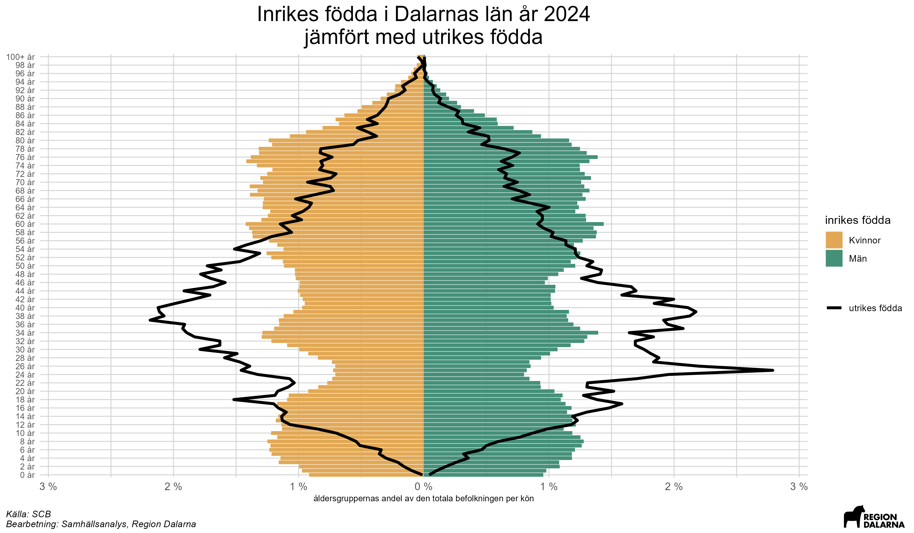

```{r setup, include=FALSE}
knitr::opts_chunk$set(echo = TRUE, warning = FALSE, message = FALSE)

# Nödvändiga paket
if (!require('pacman')) install.packages('pacman')
p_load(here,
       tidyverse,
       openxlsx,
       git2r,
       keyring)

# Funktioner som behövs (hämtas från Git-Hub)
source('https://raw.githubusercontent.com/Region-Dalarna/funktioner/main/func_SkapaDiagram.R')
source('https://raw.githubusercontent.com/Region-Dalarna/funktioner/main/func_API.R')

# För att information från Tidyverse inte skall visas
options(dplyr.summarise.inform = FALSE)

# Här läggs figurerna
outputmapp = here('Figurer','/')

# Om man vill uppdatera den externa hemsidan sätts denna variabel till TRUE
uppdatera_hemsida = FALSE

# Om man vill uppdatera data sätts denna variabel till TRUE
#uppdatera_data = FALSE

# Om man vill spara figurer sätts denna variabel till TRUE
spara_figur = FALSE

# if(skapa_lista == TRUE){
# source(here('master_kvinnor_man.R'), encoding = 'utf-8', echo = FALSE)
# lista_figurer=c(lista_figurer,hamta_figurer(skapa_ppt=FALSE))
# }
# 
# if(uppdatera_data == TRUE){
# source(here('Skript','1_hamta_data.R'), encoding='UTF-8')
# }

# Läser in data (ett exempel på hur det kan se ut - byt ut detta)
utbildning_df <- read.xlsx('G:/skript/projekt/data/kvinnor_man/utbildningsniva.xlsx')
utbildning_85_df <- read.xlsx('G:/skript/projekt/data/kvinnor_man/utbildningsniva_85.xlsx')
```

<p style = "font-size:12px">
<i>Rapporten är skapad av Samhällsanalys, Region Dalarna<br>
Senast uppdaterad: `r Sys.Date()`</i>
</p>

# Sammanfattning {-}

<ul>

<li>Dalarna har en negativ befolkningsutveckling över tid med allt fler äldre inrikes födda och allt färre i arbetsför ålder. De senaste decenniernas invandring har bromsat den negativa utvecklingen, bidragit till en föryngring av befolkningen och arbetsmarknadens kompetensförsörjning</li>

<li>Utvecklingen på arbetsmarknaden för utrikes födda under senare år är mycket positiv med nästan en halvering av arbetslösheten sedan 2020. Den förbättrade sysselsättningen ger i sin tur en positiv utveckling för utrikes födda i form av förbättrad ekonomi, minskad trångboddhet och färre i behov av ekonomiskt stöd. Däremot har genomströmningstiden för godkänt i SFI ökat det senaste decenniet, vilket behöver adresseras då språkkunskaperna är viktigt för utbildning och etablering på arbetsmarknaden</li>

<li>Högre utbildningsnivåer samt längre vistelsetider i Sverige för utrikes födda har en markant positiv effekt när det gäller att minska skillnaderna i utbildningssystemet och på arbetsmarknaden mot inrikes födda, men det finns trots det kvarstående skillnader i form av exempelvis lägre gymnasiebehörigheter, högre arbetslöshet och lägre inkomster</li>

<li>Sammantaget observeras en mycket positiv utveckling, men de kvarstående skillnaderna visar på vikten av ett fortsatt integrationsarbete med fokus på språk, utbildning och arbete för att minska skillnader mellan inrikes och utrikes födda</li>

</ul>

# Inledning {-}
I år är det 10 år sedan året då Sverige registrerade det högsta antalet asylsökande genom tiderna. 2015 sökte närmare 163 000 personer asyl i Sverige och för Dalarnas del blev 2016 det år då invandringen var som störst efter att de asylsökande fått uppehållstillstånd och folkbokförts i länet. 

I november 2015 uttryckte regeringen att trycket var stort på det svenska samhället och att Sverige behövde "ett andrum för svenskt flyktingmottagande". I och med det skärptes migrationspolitiken. Regeringen var trots det tydlig med att det stora mottagandet skulle "vara en stolthet för oss när historien skrivs" [(Sveriges Radio, 2015)](https://www.sverigesradio.se/artikel/6310364){target="_blank"}^[Sveriges Radio, 2015. Regeringens besked om skärpt flyktingpolitik, 2015-11-25.]. [Riksrevisionen (2017)](https://www.riksdagen.se/sv/dokument-och-lagar/dokument/riksrevisionens-granskningsrapport/lardomar-av-flyktingsituationen-hosten-2015-_h5b54/){target="_blank"}^[Riksrevisionen, 2017. Granskningsrapport 2017:4, Lärdomar av flyktingsituationen hösten 2015 - beredskap och hantering.] granskade de centrala offentliga aktörernas beredskap och bedömde att beredskapen brast i vissa avseenden, men att kärnuppdraget ändå i huvudsak kunde genomföras. 

År 2019 publicerade Region Dalarna rapporten [Nulägesbeskrivning av integrationen i Dalarna, ett regionalt perspektiv](https://www.regiondalarna.se/contentassets/d845727dbc9f49c3b7b09a2c60456497/integrationsanalys.pdf){target="_blank"}^[Region Dalarna, 2019. Nulägesbeskrivning av integrationen i Dalarna, ett regionalt perspektiv. Regionala utvecklingsförvaltningens rapportserie #1.]. Rapporten skrevs med syfte att följa upp hur den höga asylinvandringen till Sverige och Dalarna påverkat länet. År 2016 registrerades cirka 30 000 asylsökande och fram till pandemin registrerades mellan 20-30 000 årligen. År 2024 hade asylinvandringen minskat till cirka 10 000, en nivå som är den lägsta sedan 1996, och en del i det paradigmskifte som nuvarande regering verkar för, med ambitioner att öka arbetskraftsinvandringen och minska asylinvandringen [(Regeringen, 2025)](https://www.regeringen.se/pressmeddelanden/2025/01/pressbriefing-om-migrationen-till-sverige-under-2024/){target="_blank"}^[Regeringen. Pressbriefing om migrationen till Sverige under 2024. 2025-01-10.].

Integration kan ses som *en process där individer eller grupper med olika bakgrunder och förutsättningar blir en del av ett större socialt, ekonomiskt eller kulturellt sammanhang, samtidigt som deras egen identitet och särart respekteras*. 

<details>

  <summary>Fördjupning - Integrationsbegreppet</summary>

<div>

Beroende på sammanhang kan integration ha olika betydelser:
<br>
<ul>

<li>**Samhällelig integration**: När människor med olika bakgrunder deltar i och bidrar till samhället på lika villkor, exempelvis genom arbete, utbildning och social interaktion. </li>

<li>**Ekonomisk integration**: Att individer eller grupper har tillgång till arbetsmarknaden och ekonomiska resurser, vilket minskar ekonomiska klyftor. </li>

<li>**Kulturell integration**: När olika kulturer möts och påverkar varandra utan att någon tvingas ge upp sin identitet. </li>

</ul>

[Amnå och Stigendal (2021)](https://mau.diva-portal.org/smash/get/diva2:1599404/FULLTEXT01.pdf){target="_blank"}^[Amnå, E. och Stigendal, M., 2021. Samhällsorientering: för en hållbar integration. Komlitt AB, Helsingborg.] betonar vikten av att vara tydlig vid användningen av begrepp kopplade till integration och hänvisar till Nationalencyklopedins definition - *integration är en process som leder till att skilda enheter förenas, men det kan även gälla resultatet av en sådan process* - och sociologins användning av begreppen strukturell och kulturell integration.

Den strukturella integrationen handlar om skyldigheter och rättigheter via samhälleliga system, lagar och regler. Den kulturella integrationen handlar mer om hur människor upplever sig som integrerade via normer, värderingar och identiteter. En känsla av delaktighet skapar kulturell integration medan en lag skapar strukturell integration. I grunden handlar det här om alla individer som lever i ett land, även om den vardagliga diskussionen i mångt och mycket handlar om invandrade i förhållande till de som är födda och uppväxta i ett land.

</div>
 
</details>

Även om integrationsbegreppet är brett, präglas samhällsdebatten av hur utrikes födda ska integreras i det svenska samhället. Det gör att det är viktigt att belysa hur utrikes födda förhåller sig till inrikes födda inom ett antal samhällsområden. Samhällets förmåga att intregrera utrikes födda i utbildning, arbetsmarknad eller boende är avgörande för exempelvis kompetensförsörjningen på kort och lång sikt. 

Den här rapportens syfte är att redovisa aktuell statistik relaterat till utrikes föddas integration i samhället i Dalarna och visa på utvecklingen över tid. Som utgångspunkt finns 2019 års rapport, men en anpassning till dagens situation och kunskap görs i stor utsträckning. Rapporten kommer inte att behandla frågor som rör invandringens påverkan på de offentliga finanserna eller utrikes föddas inblandning i brottslighet. För den som är intresserad av att läsa mer om dessa områden rekommenderas rapporter från [Konjunkturinstitutet](https://www.konj.se/media/kpgnt5iw/specialstudie-117-invandrades-nettobidrag-till-de-offentliga-finanserna-1983-2022.pdf){target="_blank"} och [Brottsförebyggande rådet](https://bra.se/rapporter/arkiv/2021-08-25-misstankta-for-brott-bland-personer-med-inrikes-respektive-utrikes-bakgrund){target="_blank"}.

I Region Dalarnas rapport från 2019 konstaterades bland annat att det fanns en tydlig skiljelinje mellan hur väl integrationsprocessen fungerar för gruppen utrikes födda å ena sidan, och inrikes födda med utrikes födda föräldrar respektive inrikes födda med inrikes födda föräldrar å andra sidan. Skillnaden i förutsättningar och förmåga mellan de inrikes födda, oavsett om de hade inrikes eller utrikes födda föräldrar, var relativt liten när det gäller skolresultat och sysselsättningsgrad. Distinktionen i denna rapport belyser därför primärt utrikes födda i jämförelse med inrikes födda. En uppdelning sker även för kvinnor och män i de delar det är relevant, som exempelvis utbildningsnivåer samt vistelsetid i landet. I vissa diagram används även begreppet *Född i Sverige*, vilket ska likställas med inrikes född.

# Befolkningsutveckling och invandring
Sverige är sedan en längre tid inne i en demografisk fas där de stora babyboom-kullarna från slutet av 1940- och början av 1950-talet uppnåt pensionsålder och nästa generation från 1960-talet börjar närma sig pension. Många svenska kommuner har en alltmer ålderstigen befolkning, en effekt av den urbaniseringsvåg som pågått sedan tidigt 1900-tal, då många unga lämnat landsbygden och mindre tätorter till förmån för residens- och universitetsstäder. Förutom att befolkningsutvecklingen medför färre skattebetalare som ska försörja allt fler äldre så innebär den också ett stort kompetensförsörjningsproblem.

En stor andel äldre i befolkningen medför ekonomiska påfrestningar för en kommun då allt färre i arbetsför ålder ska försörja dem som inte förvärvsarbetar, det vill säga äldre och barn. Redan i [Långtidsutredningen (2015)](https://www.regeringen.se/contentassets/86d73b72a97345feb2a8cbc8b6700fa7/sou-2015104-langtidsutredningen-2015-huvudbetankande/){target="_blank"}^[Regeringen, 2015. Långtidsutredningen 2015, Statens Offentliga Utredningar 2015:104.] gjordes beräkningar på hur mycket kommunalskatten skulle behöva höjas i kommunerna för att upprätthålla samma servicenivå år 2040 som då, som en följd av den förändrade demografiska strukturen. Beräkningarna visade på cirka 50-procentiga ökningar, i mångas ögon orimliga skattehöjningar, vilket kan ses som en signal på hur allvarlig situationen var redan för tio år sedan.  

I [Långtidsutredningen (2019)](https://www.regeringen.se/contentassets/ec035a7de89549eaacc14d82f54b4396/sou-2019_65_webb.pdf){target="_blank"}^[Regeringen, 2019. Långtidsutredningen 2019, Statens Offentliga Utredningar 2019:65.] beräknas statsbidragen till kommunsektorn, vid oförändrade kommunalskatter, behöva nästan fördubblas fram till 2035 för att möta den demografiskt betingade efterfrågan på kommunala tjänster. Utmaningen ligger dock inte främst i finansieringen, utan i att hitta arbetskraften. Störst brist på personal förväntas uppstå i landsbygdsregioner, vilket riskerar att leda till ökad ojämlikhet i levnadsförhållanden och utvecklingsmöjligheter.

Andelen utrikes födda som är i arbetsför ålder (20-64 år) i Dalarna har ökat successivt över de senaste 20 åren, från `r andel_utrikes_min_ar` procent år `r andel_utrikes_inrikes_min_ar` till `r andel_utrikes_max_ar` procent år `r andel_utrikes_inrikes_max_ar`. Ökningen var särskilt tydlig under några år på mitten av 2010-talet i samband med den stora flyktingströmmen och invandringen till Sverige och Dalarna. Utrikes födda har blivit en förutsättning för att kunna kompetensförsörja arbetsmarknaden i Dalarna. 

```{r, echo = FALSE, message = FALSE, warning = FALSE, fig.height=5, fig.width=8, fig.align='center'}
gg_andel_utrikes_inrikes$befolkning_utr_inr_andel_Dalarna
```
<br>

För att få en förståelse för den utrikes födda befolkningen i Dalarna och hur invandringen sett ut över tid, behöver situationen i riket som helhet analyseras. Arbetskraftsinvandringen, främst från Norden, tog fart efter andra världskriget och pågick fram till 1960-talets slut. I mitten av 1980-talet förändrades invandringens karaktär och fler flyktingar togs emot till följd av globala katastrofer. Från 1990-talet och framåt har krigssituationer i olika delar av världen föranlett en högre grad av flyktinginvandring med kriget i Syrien i mitten av 2010-talet som den tid då asylinvandringen nådde över 160 000 personer i Sverige. Därefter har antalet asylsökande minskat successivt och `r asylsokande_max_ar` sökte `r asylsokande_senaste_ar_antal` personer asyl i Sverige, vilket är det lägsta antalet sedan 1996. En ökning av antalet asylansökningar noteras under 2022 i samband med Rysslands anfallskrig mot Ukraina, men 2024 är antalet asylsökande det lägsta på nästan 30 år.

```{r, echo = FALSE, message = FALSE, warning = FALSE, fig.height=5, fig.width=8, fig.align='center'}
gg_asylsokande_antal$asylsokande_antal
```
<br>

För en fördjupad beskrivning av den utrikes födda befolkningens utveckling i Sverige och Dalarna, se fördjupningsavsnittet *Historisk överblick av invandringen i Dalarna*.

<details>

  <summary>Fördjupning - Historisk överblick av invandringen i Dalarna</summary>

<div>

Den första större invandring som påverkat Dalarna i modern tid var den arbetskraftsinvandring som skedde efter andra världskriget. Denna epok varade i stort sett under två decennier, d.v.s. under 1950- och 1960-talet.

Den svenska ekonomin expanderade snabbt efter kriget, vilket gjorde att efterfrågan på arbetskraft var större än tillgången i landet. Bristen berodde även på att ålderskullarna födda på 1920- och 30-talet var relativt små. Arbetskraftsinvandrarna kom främst från Norden, men även från övriga Europa. En överenskommelse om en gemensam nordisk arbetsmarknad år 1954 innebar att framför allt många finländare invandrade under 1960- och 70-talet, då det även var lågkonjunktur i Finland. I Dalarnas län bosatte sig dessa främst i kommuner där det fanns stor tillverkningsindustri så som i Gagnef, Borlänge, Avesta
och Ludvika. En mycket liten andel av invandringen under denna tid kom från andra världsdelar. Efter andra världskriget och fram till 1970-talet låg arbetskraftsinvandringen i hela Sverige på en förhållandevis hög nivå, men i mitten av 1970-talet upphörde i princip all arbetskraftsinvandring för en tid. 

I mitten av 1980-talet växte en ny typ av immigration fram. Tidigare hade de invandrare som sökt sig till Sverige av flyktingskäl främst gjort det under enstaka katastrofer. Detta scenario förändrades efter år 1984. I takt med den växande globaliseringen ökade de politiska kraven på att den rika världen borde ta sitt ansvar och acceptera flyktingar från Asien, Afrika och Mellanöstern. Sverige var ett av de länder som till en början framträdde med en jämförelsevis generös flyktingpolitik. År 1987–90 togs omkring 20 000 flyktingar emot årligen i Sverige. Detta gjorde att antalet invandrade/immigranter i Dalarna ökade under tidsperioden.

När Jugoslavien drabbades av flera inbördeskrig under första hälften av 1990-talet ökade antalet immigranter till Sverige väsentligt. I utsatta krigszoner, inte minst från Bosnien-Hercegovina, flydde långt över 100 000 människor till Sverige. Under andra hälften av 1990-talet minskade invandringen men har sedan dess varit högre. Under 2000-talet har invandringen ökat över tid, till stor del på grund av de människor som flyr från krig och förtryck i bland annat Irak, Afghanistan, Somalia och Syrien. Idag är flyktinginvandringen ett strukturellt fenomen som inte förväntas upphöra så länge det finns förtryck och krig i världen. Att invandringen har ökat beror även på ett ökat antal arbetskraftsinvandrare från nya EU-stater och fler utländska studenter.

Efter att kriget bröt ut i Syrien 2011, ökade invandringen kraftigt och nya toppnoteringar av antalet asylsökande gjordes varje år. Under 2015 var antalet asylsökande som högst, då `r asylsokande_2015` personer sökte asyl i Sverige. Detta var mer än dubbelt så många som under 2014 och nästan en fördubbling av den tidigare högsta noteringen från 1992 då det var krig i forna Jugoslavien.

Under den stora ökning av antalet asylsökande som skedde hösten 2015 hamnade migrations- och integrationsfrågorna högt upp på den politiska dagordningen och Sverige införde därefter en mer restriktiv immigrationspolitik. I Dalarnas län slog invandringen rekord år 2016 med 4 725 personer som immigrerade under året. Därefter har antalet immigranter i länet minskat och år 2024 bodde 2 028 personer i Dalarna som hade invandrat samma år. 

Enligt internationell rätt har flyktingar rätt till skydd, så kallad asyl. Asylsökande är den som har ansökt om att få sitt skyddsbehov undersökt i ett land och därigenom få sin rätt till asyl prövad. En utländsk medborgare som erhållit uppehållstillstånd på grund av asyl, har fått det eftersom personen anses vara en flykting enligt utlänningslagen.

Efter år 2015 har antalet ansökningar om asyl i Sverige minskat. Anledningarna till detta är flera. Flyktingavtalet mellan Turkiet och EU har gjort att möjligheterna för asylsökande att ta sig över gränserna i Europa har försvårats. På svensk nivå har lagstiftningen förändrats genom att tidsbegränsade uppehållstillstånd i regel delas ut istället för permanenta, samt att familjeåterförening har försvårats. De gränskontroller som infördes i södra Sverige i början av 2016 gör att personer som saknar giltig legitimation inte längre har möjlighet att ta sig in i landet. De nya ID-kontrollerna kombinerat med andra åtgärder i Sverige och Europa har haft en stor påverkan på antalet asylsökande. Under `r asylsokande_max_ar` sökte `r asylsokande_senaste_ar_antal` personer asyl i Sverige, vilket är det lägsta antalet sedan 1996.

```{r, echo = FALSE, message = FALSE, warning = FALSE, fig.height=5, fig.width=8, fig.align='center',include=FALSE}
gg_asylsokande_antal$asylsokande_antal
```

Ett stort antal asylsökande ett år leder ofta till att invandringen ökar året därpå. Det beror på att asylsökande räknas som invandrade först när de har fått uppehållstillstånd och folkbokförts i Sverige. Detta gör att antalet immigranter i hög grad påverkas av hur många beslut om uppehållstillstånd Migrationsverket fastställer, samt hur stor andel av dessa ärenden som blir beviljade. Rekordnivån för antalet asylsökande år 2015, ledde till att invandringen slog rekord i Sverige år 2016. Även statistiken för åren 2017 och 2018 påverkades av det stora antalet asylsökande år 2015. Detta eftersom många fick vänta länge på beslut om huruvida de fick stanna i landet, och för att anhöriga till de som fick uppehållstillstånd sedan ville flytta till Sverige.

</div>
 
</details>

Den totala befolkningen i Dalarna varierar en del över tid och var som störst 1994 med 291 203 invånare, men minskade därefter till 275 618 år 2007. Vid utgången av 2024 noterades 286 546 invånare i länet, vilket är en minskning från de senaste årens högsta nivå, 288 387 år 2021. Mellan `r min_ar_utrikes_antal` och `r max_ar_utrikes_antal` ökade antalet utrikes födda personer i Dalarnas län från `r min_antal_utrikes` till `r max_antal_utrikes` personer. Effekten av den ökade invandringen under 2000-talet är därmed att den utrikes födda befolkningen i Dalarna har mer än fördubblats. Ökningen skedde fram till 2019, men därefter har den utrikes födda befolkningen i Dalarna minskat något. Antalet inrikes födda minskade under samma tid från `r min_antal_inrikes` personer till `r max_antal_inrikes` personer. Genom att studera befolkningsutvecklingen för inrikes och utrikes födda i länet de senaste åren, blir det tydligt att befolkningen i länet som helhet hade minskat utan invandringen.

```{r, echo = FALSE, message = FALSE, warning = FALSE, fig.height=5, fig.width=8, fig.align='center'}
gg_antal_utrikes$utrikes_fodda_antal_Dalarna
```
<br>

På kommunnivå ökade befolkningen totalt sett i 8 av länets kommuner mellan år 2000–2024, medan den minskade i 7 av dem (se det vänstra diagrammet nedan). Antalet utrikes födda personer har under tidsperioden ökat i Dalarnas läns samtliga kommuner, medan antalet inrikes födda personer har minskat i alla kommuner förutom Falun och Gagnef. Slutsatsen blir att de kommuner i länet som har växt i invånarantal, med undantagen Falun och Gagnef, har gjort det som en följd av invandring, medan de kommuner som krympt har begränsat befolkningsminskningen genom att fler har invandrat än utvandrat. Noteras bör även att utrikes föddas barn ingår i kategorin inrikes födda. Ökningen av antalet utrikes födda var i relation till befolkningsmängd störst i Hedemora, Avesta, Ludvika och Borlänge. 

```{r, echo = FALSE, message = FALSE, warning = FALSE, fig.height=5, fig.width=8, fig.align='center',include=FALSE}
gg_antal_utrikes$befolkningsforandring_Dalarna
```

I det högra diagrammet nedan syns att andelen av befolkningen som är utrikes födda är lägre i samtliga Dalarnas kommuner jämfört med riket, där ungefär `r andel_utrikes_Sverige_sista_ar` procent av invånarna är födda i ett annat land än Sverige år `r andel_utrikes_senaste_ar`. Högst andel utrikes födda i Dalarna återfinns i `r andel_utrikes_kommun_hogst_sista_ar` där ungefär `r andel_utrikes_kommun_hogst_sista_ar_varde` procent av befolkningen är utrikes födda. Även Borlänge och Avesta har en relativt stor andel utrikes födda (`r andel_utrikes_Borlänge_sista_ar` respektive `r andel_utrikes_Avesta_sista_ar` procent). Lägst andel utrikes födda finns i `r andel_utrikes_kommun_lagst_sista_ar`, där endast `r andel_utrikes_kommun_lagst_sista_ar_varde` procent av befolkningen är utrikes födda. 

```{r, echo = FALSE, message = FALSE, warning = FALSE, fig.height=5, fig.width=8, fig.align='center',include=FALSE}
gg_andel_utrikes$utrikes_fodda_andel_Dalarna
```

```{r, echo = FALSE, message = FALSE, warning = FALSE, fig.height=5, fig.width=8, fig.align='center'}
gg_kombo
```
<br>

Andelen utrikes födda har ökat i samtliga av Dalarnas kommuner mellan `r andel_utrikes_forsta_ar` och `r andel_utrikes_senaste_ar`, vilket kommer av att invandringen varit större än utvandringen under hela 2000-talet, samtidigt som antalet inrikes födda minskat i de flesta kommuner. Hur stor ökningen varit skiljer dock tydligt mellan kommunerna. I `r andel_utrikes_kommun_hogst_sista_ar` har andelen utrikes födda exempelvis ökat med `r andel_utrikes_kommun_hogst_forandring_varde` procentenheter sedan  `r andel_utrikes_forsta_ar`, medan ökningen har varit klart lägre i näraliggande Smedjebacken (ungefär `r andel_utrikes_smedjebacken_forandring_varde` procentenheter under samma tidsperiod) eller Gagnef (ungefär `r andel_utrikes_Gagnef_forandring_varde` procentenheter).

För att förstå befolkningsutvecklingen i Dalarna är det även viktigt att undersöka de delar som, vid sidan om invandringen, påverkar befolkningsutvecklingen; födelseöverskottet och den inrikes flyttningen.

Mellan år `r befforandring_komponent_min_ar` och `r befforandring_komponent_max_ar` har antalet döda i Dalarna varit fler än antalet födda och antalet utflyttade till övriga Sverige har varit fler än antalet inflyttade från övriga Sverige. Totalt flyttade `r inrikes_flyttningsoverskott_netto` personer netto från Dalarna till andra delar av Sverige under perioden, medan det dog `r fodelseunderskott_netto` fler personer än det föddes. Under samma period var invandringsöverskottet `r invandringsoverskott_netto` personer. Att Dalarnas befolkning har växt under 2000-talet beror således på att invandringen har varit relativt stor.

```{r, echo = FALSE, message = FALSE, warning = FALSE, fig.height=5, fig.width=8, fig.align='center'}
gg_befforandring_komponenter$`befolkningsforandring_per_komponent_Dalarnas län_ar2000-2024`
```
<br>

Födelseunderskottet minskade successivt från år 2000 och fram till 2019, för att därefter öka kraftigt fram till 2024. Utvecklingen till 2019 beror i stor grad på att de stora ålderskullar som föddes runt 1990 befann sig i barnafödande åldrar, samt en generös familje- och socialpolitik och en stor invandring. De som invandrade till Dalarna i mitten av 2010-talet var generellt sett unga och i en ålder när det är vanligt att skaffa barn. Utrikes födda kvinnor har även en hög fruktsamhet direkt efter att de invandrat till Sverige, men därefter minskar den successivt. Att fruktsamhetstalen är extra höga bland kvinnor som nyligen invandrat beror sannolikt på att många kvinnors invandring är knutet till familjebildning, och att de kommer till Sverige för att återförenas med sin familj eller för att bilda familj. 

De senaste årens markanta minskning av födelsetalen är en fråga som förvånar demografer. Det är inte längre en lika tydlig koppling mellan makroekonomiska upp- och nedgångar eller välfärdssystemets utformning och födslar. Nedgången verkar mer vara knuten till oro inför framtiden och påverkar framför allt sannolikheten att skaffa sitt första barn. För en fördjupad genomgång av förändringar i födelsetal, se avsnitt 2.1 i [Befolkningsutvecklingen i Dalarna](https://samhallsanalys.regiondalarna.se/befolkningsutveckling){target="_blank"}^[Befolkningsutvecklingen i Dalarna, Samhällsanalys, Region Dalarna (2025-03-25).].

Förutom att antalet immigranter var stort under framförallt mitten på 2010-talet, har ursprungsländerna förändrats över tid, med ett större antal asylsökande från utomeuropeiska länder. År `r fodelseland_senaste_ar` kan konstateras att det skett omflyttningar av de tio största födelseländerna bland utrikes födda invånare i Sverige. År `r fodelseland_senaste_ar` var `r storsta_fodelseland_senaste_ar` det land som flest invånare i Dalarna var födda i (vid sidan om Sverige). Totalt `r storsta_fodelseland_senaste_ar_antal` invånare i Dalarna hade `r storsta_fodelseland_senaste_ar` som födelseland. Detta är en stor förändring mot 2010, då antalet invånare i Dalarna med Syrien som födelseland kan räknas i låga hundratal. Orsaken till detta är naturligtvis inbördeskriget i Syrien under 2010-talet, när många från landet flydde till Europa och Sverige. Andra länder från vilka invandringen har ökat tydligt under 2000-talet är Somalia och Eritrea. 

Det land som näst flest invånare i Dalarna var födda i år `r fodelseland_senaste_ar` var `r andra_fodelseland_senaste_ar` med `r andra_fodelseland_senaste_ar_antal` invånare. Detta är en tydlig minskning sedan år 2000, när antalet invånare i Dalarna med Finland som födelseland var drygt 6 000. Orsaken till detta är att många invandrade från Finland under åren runt och efter andra världskriget. Dessa börjar således komma upp i åren och eftersom relativt få flyttar till Sverige från Finland idag minskar antalet personer som är födda i Finland i Dalarna stadigt.

```{r, echo = FALSE, message = FALSE, warning = FALSE, fig.height=5, fig.width=8, fig.align='center'}
gg_storsta_fodelseland$storsta_fodelseland_Dalarna
```
<br>

När de utrikes födda personer som är bosatta i Dalarna kartläggs utifrån deras invandringsår till Sverige, framgår att många invandrade i mitten av 2010-talet. Sedan dess har åtskilliga lämnat Dalarna, men `r invandringsar_antal_df_max_ar` är fortfarande det år när flest utrikes födda boende i Dalarna invandrade till Sverige. År `r invandringsar_senaste` bodde `r invandringsar_senaste_antal` personer i Dalarna som hade invandrat till Sverige samma år, vilket är klart fler än åren innan. Detta kan naturligtvis delvis förklaras av att vissa som invandrade under åren innan har lämnat Dalarna för andra delar av Sverige, men en viktig orsak är också att personer födda i Ukraina, som tidigare haft ett uppehållstillstånd med tillfälligt skydd enligt massflyktdirektivet, har haft möjlighet att ansöka om att bli folkbokförda i Sverige sedan i juni 2024. 

```{r, echo = FALSE, message = FALSE, warning = FALSE, fig.height=5, fig.width=8, fig.align='center'}
gg_antal_invandringsar$invandringsar_antal
```
<br>

Vid en analys av åldersfördelningen bland Dalarnas befolkning uppdelat på den inrikes- och utrikes födda befolkningen blir det tydligt att den utrikes födda befolkningen i länet är väsentligt yngre än den inrikes födda, och innefattar en större andel personer i arbetsför ålder (se de svarta linjerna i diagrammet nedan). Detta beror på att personer som invandrar generellt är yngre än genomsnittet för en befolkning. Följden blir att invandringen totalt sett har gett en föryngrande effekt på befolkningen. Det finns även stora variationer i medelålder mellan olika grupper av utrikes födda beroende på invandringsår och födelseland. Utrikes födda utgör ungefär `r andel_utrikes` procent av den totala befolkningen i Dalarnas län och är därmed betydligt färre än inrikes födda.

```{r, echo = FALSE, message = FALSE, warning = FALSE, fig.height=5, fig.width=8, fig.align='center'}

```
<br>

Befolkningen i arbetsför ålder (`r unique(antal_forandring_lan_kumulativ$alder_grupper)`) är särskilt intressant att fokusera på då den bidrar till att balansera en allt äldre befolkning och förbättrar möjligheten att säkerställa tillgång till arbetskraft för näringsliv och offentlig sektor i framtiden.

Mellan år `r min_ar_utrikes_kumulativ` och `r max_ar_utrikes_kumulativ` minskade antalet inrikes födda i arbetsför ålder i Dalarnas län med `r kumulativ_summa_inrikes` personer, samtidigt som antalet utrikes födda i samma åldersgrupp ökade med `r kumulativ_summa_utrikes` personer. Minskningen av antalet inrikes födda berodde på att ålderskullarna som fyllde 65 år var större än de som fyllde 20 år, samt en större inrikes utflyttning än inflyttning. Den inrikes födda befolkningen i arbetsför ålder minskade allra mest åren 2010–2015, vilket berodde på att det stora antalet personer födda i slutet av 1940-talet uppnådde pensionsålder.

```{r, echo = FALSE, message = FALSE, warning = FALSE, fig.height=5, fig.width=8, fig.align='center'}
gg_antal_utrikes$befolkningsforandring_lan_Dalarna
```
<br>

Enligt SCB:s befolkningsprognos från juni 2024 förväntas antalet utrikes födda i Dalarnas län mellan `r unique(antal_forandring_prognos_kumulativ$alder_grupper)` att `r ifelse(kumulativ_summa_utrikes_max_prognos>0,"öka","minska")` med `r kumulativ_summa_utrikes_max_prognos_abs` personer mellan `r min_ar_utrikes_kumulativ_prognos` och `r max_ar_utrikes_kumulativ_prognos`, medan antalet inrikes födda personer i länet förväntas att `r ifelse(kumulativ_summa_inrikes_max_prognos>0,"öka","minska")` med `r kumulativ_summa_inrikes_max_prognos_abs` personer [(SCB Statistikdatabasen)](https://www.statistikdatabasen.scb.se/pxweb/sv/ssd/START__BE__BE0401__BE0401A/BefProgRegFakN/){target="_blank"}^[SCB, Statistikdatabasen, Aktuella framskrivningar, Folkmängd efter region, inrikes/utrikes född, ålder och kön. År 2024 - 2070.].

Enligt prognosen kommer antalet personer mellan `r unique(antal_forandring_prognos_kumulativ$alder_grupper)` således att minska tydligt i Dalarna fram till `r max_ar_utrikes_kumulativ_prognos`, vilket förstärker länets utmaningar med arbetskrafts- och kompetensförsörjning. Det blir då extra viktigt att ta vara på den resurs som utrikesfödda kan utgöra, annars riskerar såväl näringsliv som offentlig sektor att få mycket svårt med arbetskraftsförsörjningen.

```{r, echo = FALSE, message = FALSE, warning = FALSE, fig.height=5, fig.width=8, fig.align='center'}
gg_antal_utrikes$befolkningsprognos_lan_Dalarna
```
<br>

Den demografiska översikten visar således att andelen utrikes födda i Dalarna ökat över tid och bidragit till att både föryngra och vidmakthålla länets invånarantal.

# Språk och utbildning
Ett viktigt steg för att kunna integreras i ett samhälle är att lära sig språket. Språkkunskaper ger förutsättningar för utbildning som i sin tur skapar möjligheter på arbetsmarknaden. I detta avsnitt görs en genomgång av utvecklingen för utrikes födda inom språk och utbildning. I nästa avsnitt diskuteras utvecklingen på arbetsmarknaden

## Språk
Att ha grundläggande kunskaper i det officiella språket är viktigt för att kunna delta i samhället, både socialt, ekonomiskt och kulturellt. För att underlätta integrationen av nyanlända har Sverige ett system för svenskundervisning för invandrare, hädanefter benämnt SFI. SFI är en utbildning som erbjuds till personer som är bosatta i Sverige men saknar sådana grundläggande kunskaper i svenska språket som utbildningen syftar till att ge. Från andra kalenderhalvåret det år hen fyller 16 år har personen rätt till SFI ([Skolverket](https://www.skolverket.se/regler-och-ansvar/ansvar-i-skolfragor/ratt-till-sfi){target="_blank"}).

Vistelsetiden för de personer boende i Dalarna som blivit godkända i SFI har förändrats relativt mycket över tid, men oavsett utbildningsnivå har vistelsetiden ökat över tid. Under några år i slutet på 1990-talet hade de män och kvinnor med förgymnasial utbildning som blivit godkända i SFI varit i Sverige ungefär 1300-1400 dagar (medianvärde). Därefter såväl ökade som minskade vistelsetiden fram till mitten av 2010-talet, innan den ökade tydligt fram till åren runt pandemin (2020-2021). År `r sfi_max_ar` hade de män och kvinnor med förgymnasial utbildning som blev godkända i SFI i Dalarna varit i Sverige i `r sfi_sistaar_varde_forgymnasial` dagar, vilket är ungefär lika länge som de som blev godkända åren innan. För personer med längre utbildningar (gymnasial eller eftergymnasial) är trenden liknande, men vistelsetiden generellt kortare. 

```{r, echo = FALSE, message = FALSE, warning = FALSE, fig.height=5, fig.width=8, fig.align='center'}
gg_SFI$sfi_vistelsetid_tidsserie_Dalarna
```
<br>

Hur lång tid det tar att slutföra SFI, från när personen invandrade till Sverige (vistelsetid), påverkas av vilken utbildningsnivå den invandrade har. Kvinnor med förgymnasial utbildning som blev godkända i SFI år `r sfi_max_ar` hade varit i Sverige i `r sfi_kvinnor_forgymnasial` dagar (medianvärde), att jämföra med `r sfi_kvinnor_gymnasial` dagar för kvinnor med gymnasial utbildning. För kvinnor med högst utbildning (eftergymnasial) tog det `r sfi_kvinnor_eftergymnasial` dagar, vilket alltså är något längre tid än för de med gymnasial utbildning.

Män med förgymnasial utbildning som blev godkända i SFI under år `r sfi_max_ar` hade varit i Sverige betydligt kortare tid än kvinnorna med motsvarande utbildning, `r sfi_man_forgymnasial` dagar (medianvärde). Till skillnad från kvinnorna hade dock de män med gymnasial utbildning som blivit godkända under år `r sfi_max_ar` varit i Sverige längre tid än motsvarande personer med förgymnasial utbildning, hela `r sfi_man_gymnasial` dagar, vilket även är klart längre än kvinnorna med gymnasial utbildning som blev godkända. De män med längst utbildning (eftergymnasial) hade varit i Sverige i `r sfi_man_eftergymnasial` dagar när de blev godkända i SFI år `r sfi_max_ar`, vilket är något kortare tid än kvinnorna med motsvarande utbildning.

```{r, echo = FALSE, message = FALSE, warning = FALSE, fig.height=5, fig.width=8, fig.align='center'}
gg_SFI$sfi_vistelsetid_senastear_Dalarna
```
<br>

En orsak till att vistelsetiden ökade stadigt för de som blev godkända från mitten av 2010-talet, oavsett utbildningsbakgrund, kan vara att många då invandrade till Sverige. Det, i kombination med en pandemi som sannolikt försvårade möjligheterna till undervisning, kan ha gjort att det tog längre tid att slutföra SFI och har resulterat i historiskt långa vistelsetider för att nå godkänt i SFI.

Från 1 januari 2025 har kraven på att delta i SFI skärpts. Deltagande är bland annat begränsat till tre år och en individuell studieplan ska upprättas i samband med antagning. Det innebär att genomströmningstiderna behöver återgå till den nivå som rådde innan pandemin, utan att kvaliteten i utbildningen försämras. En sänkning av genomströmningstiderna ökar i sin tur möjigheten att gå vidare i utbildningssystemet och skynda på integrationsprocessen.

## Utbildning
En fullgjord gymnasieutbildning är en av de viktigaste faktorerna för ett gott liv på många sätt, såsom hälsa, inkomst, medellivslängd och möjligheten till arbete. De med en högre utbildning lever generellt längre ([SCB](https://www.scb.se/hitta-statistik/statistik-efter-amne/befolkning-och-levnadsforhallanden/befolkningens-sammansattning-och-utveckling/demografisk-analys/pong/statistiknyhet/livslangd-efter-utbildningsniva/){target="_blank"}), har en genomsnittligt högre inkomst ([SCB](https://www.scb.se/hitta-statistik/sverige-i-siffror/utbildning-jobb-och-pengar/medelloner-i-sverige/){target="_blank"}) och mår i allmänhet bättre än de med lägre utbildning ([FHM](https://www.folkhalsomyndigheten.se/contentassets/ca6067606d8847f7945e922642853caf/utbildning-halsa-faktablad.pdf){target="_blank"}). Utbildningsnivån hos utrikes födda har därför en stor påverkan på möjligheterna att etablera sig i samhället, särskilt bland de unga som anländer till Sverige under skolåren och har hela arbetslivet framför sig. Idag behövs det enligt Arbetsförmedlingen i regel gymnasiekompetens för att ha en god chans att etablera sig på arbetsmarknaden, även när det gäller bristyrken. 

Att gruppen utrikes födda är en heterogen grupp blir tydligt när utbildningsnivån studeras (se diagram nedan). Den största skillnaden mellan utrikes och inrikes födda är att en större andel av de utrikes födda har en förgymnasial utbildning och en mindre andel gymnasial utbildning. Andelen personer som har eftergymnasial utbildning är ungefär densamma för inrikes och utrikes födda. En lite högre andel kvinnor födda i Sverige har eftergymnasial utbildning än utrikes födda kvinnor, men bland män är förhållandet det omvända. Arbetskraftsinvandrare har generellt sett en högre utbildningsnivå än flyktinginvandrare, och skillnaderna i utbildningsnivå är även stora mellan olika ursprungsländer.

```{r, echo = FALSE, message = FALSE, warning = FALSE, fig.height=5, fig.width=8, fig.align='center'}
gg_utbniva_bakgrund$utbniva_inr_utr_kon_Dalarna_ar2023
```
<br>

Eftersom det finns stora skillnader i utbildningsbakgrund bland utrikes födda, är det svårt att tala om dem som en samlad grupp. Personer med låg respektive hög utbildning stöter på olika typer av utmaningar på arbetsmarknaden.

En förhållandevis stor andel av de utrikes födda i Dalarna hade år 2024 en eftergymnasial utbildning om minst 3 år. Högst utbildning hade de som relativt nyligen invandrat till Sverige, vilket är en indikation på att en större andel av dessa är arbetskraftsinvandrare. Exempelvis har ungefär `r utb_niva_vistelsetid_2_3_eftergym` procent av de som invandrade till Sverige mellan 2021 och 2022 (2-3 år i diagrammet nedan) och nu bor i Dalarna en eftergymnasial utbildning om minst tre år, vilket är klart fler än motsvarande andel bland inrikes födda. Bland övriga utbildningsnivåer ökar andelen med gymnasial utbildning tydligt ju längre tid som gått sedan invandringen. Störst andel med förgymnasial utbildning finns bland de som invandrat mellan 2015 och 2020 (4-9 år i diagrammet nedan).

```{r, echo = FALSE, message = FALSE, warning = FALSE, fig.height=5, fig.width=8, fig.align='center'}
gg_utb_niva_invandringsar$utb_niva_invandringsar
```
<br>

Viktigt att notera är även att det saknas uppgifter om utbildningsnivå för en stor andel av de utrikes födda, speciellt för dem som varit en kortare tid i landet. 

Eftersom en gymnasieutbildning förbättrar möjligheten att etablera sig på arbetsmarknaden är en viktig aspekt att undersöka hur stor andel av avgångseleverna i årskurs 9 i länet som är behöriga till att påbörja gymnasiestudier. Ofullständiga eller låga betyg är i första hand ett problem för den enskilde, då personens valmöjligheter begränsas och etableringen på arbetsmarknaden försvåras. Att en stor andel elever inte blir behöriga till gymnasiet kan även innebära ett samhällsproblem. Samhället misslyckas med att ta tillvara på elevernas potential om de inte når målen för utbildningen i skolan. Det finns även ett starkt samband mellan dåliga skolresultat och sociala problem [(Westin Lundqvist, W. m fl, 2019)](https://www.hv.se/contentassets/82eff73069584573b03f43956b661c05/laga-skolresultat-i-socialt-utsatta-omraden_.pdf){target="_blank"}^[Westin Lundqvist, W., Assmo, P. och Sunnemark, F., 2019. Låga skolresultat i socialt utsatta områden, Högskolan i Väst.]. 

Skillnaden i andelen behöriga till gymnasiet hos avgångselever i årskurs 9 mellan inrikes och utrikes födda är fortsatt stor i Dalarna. Sedan `r ar_min` har gymnasiebehörigheten för inrikes födda minskat från `r inrikes_behorighet_gym_ar_min_bada` procent till `r inrikes_behorighet_gym_ar_max_bada` procent år `r ar_max`. Skillnaden mellan inrikes födda pojkar och flickor är marginell men utvecklingen har varit svagt negativ sedan `r ar_min`. 

```{r, echo = FALSE, message = FALSE, warning = FALSE, fig.height=5, fig.width=8, fig.align='center'}
 gg_gym_hogskola_behorighet$behorighet_gymnasiet_jmf_ar
```
<br>

För utrikes födda, både pojkar och flickor, har det varit en stor variation under de senaste 20 åren. 2005 var behörigheten för utrikes födda flickor cirka 5 procentenheter lägre än för inrikes födda flickor. För utrikes födda pojkar var skillnaden nästan tre gånger så stor vid samma tidpunkt. Sedan dess har andelen behöriga utrikes födda flickor fallit fram till 2017, för att därefter öka till `r utrikes_behorighet_gym_ar_max_flickor` procent år `r ar_max`. För utrikes födda pojkar var minskningen som störst fram till 2011 för att därefter öka från `r utrikes_behorighet_gym_ar_2011_pojkar` procent till `r utrikes_behorighet_gym_ar_max_pojkar` procent år `r ar_max`. Det innebär att utrikes födda pojkar har en högre andel behöriga till gymnasiet än utrikes födda flickor år `r ar_max`, vilket är första gången sedan 2013.

Det finns stora skillnader i gymnasiebehörighet mellan grupper med olika vistelsetid i Dalarna där behörigheten är större ju längre eleverna har vistats i Sverige (se diagram nedan). Behörigheten för elever som går ut årskurs 9 med en vistelsetid som är 10 år eller längre, är i det närmaste att likställa med behörigheten för inrikes födda. I gruppen med en vistelsetid 4-9 år är behörigheten omkring `r utrikes_skillnad_10_jmf_4_9` procentenheter lägre och i gruppen vistelsetid 2-3 år är den ytterligare `r utrikes_skillnad_4_9_jmf_2_3` procentenheter lägre, vilket innebär att ungefär `r utrikes_2_3_andel` procent i gruppen har gymnasiebehörighet.

```{r, echo = FALSE, message = FALSE, warning = FALSE, fig.height=5, fig.width=8, fig.align='center'}
 gg_gym_hogskola_behorighet$behorighet_gymnasiet_vistelsetid
```
<br>

[Mörtlund (2020)](https://www.ifau.se/Forskning/Publikationer/Rapporter/2020/arbetet-med-nyanlanda-elever-i-grundskolan/){target="_blank"}^[Mörtlund, T., 2020. Arbetet med nyanlända elever i grundskolan, IFAU Rapport 2020:2.] noterade stora utmaningar med att kvalitetssäkra undervisningen i grundskolan, trots insatser kring språk- och kunskapsutvecklande arbetssätt. Att på en kort tid lära sig svenska språket och samtidigt utveckla ämneskunskaper är en svår utmaning.

En annan aspekt som är viktig att mäta är hur stor andel av avgångseleverna i gymnasiet som är behöriga till att påbörja högskolestudier. En problematik att ta hänsyn till är att SCB justerat statistiken för behöriga till högskolan under 2014-2016, vilket påverkar andelarna (se statistikfotnot hos [SCB](https://www.statistikdatabasen.scb.se/pxweb/sv/ssd/START__AA__AA0003__AA0003H/IntGr8RikKON2/){target="_blank"}). För dessa år minskar den genomsnittliga andelen behöriga med 8-9 procentenheter. Större variationer kan finnas regionalt.

Diagrammet nedan visar att utvecklingen för inrikes födda är relativt opåverkad fram till 2013, men från 2014 (syns inte i diagrammet nedan) faller andelen behöriga markant. Minskningen är som störst för män, ca `r skillnad_2013_senaste_man` procentenheter mellan 2013 och `r ar_max`. År `r ar_max` var andelen högskolebehöriga inrikes födda män ungefär `r inrikes_behorighet_hog_ar_max_man` procent. Andelen högskolebehöriga inrikes födda kvinnor har också minskat under perioden, men inte i samma utsträckning. `r ar_max` är cirka `r inrikes_behorighet_hog_ar_max_kvinnor` procent behöriga.

```{r, echo = FALSE, message = FALSE, warning = FALSE, fig.height=5, fig.width=8, fig.align='center'}
 gg_gym_hogskola_behorighet$behorighet_högksola_jmf_ar
```
<br>

Skillnaderna mellan inrikes och utrikes födda när det gäller högskolebehörighet är inte lika stora som i fallet med gymnasiebehörighet. Fram till 2013 är skillnaden några procentenheter för både kvinnor och män, men därefter faller andelen utrikes födda män med högskolebehörighet till ungefär `r utrikes_behorighet_hog_ar_2021_man` procent år 2021. `r ar_max` kan dock observeras en markant förbättring för männen. För kvinnor är inte nedgången alls lika påtaglig, utan liknar mer den för inrikes födda kvinnor. Sannolikt är detta en effekt av vilka som tagit en gymnasieexamen eller erhållit ett studiebevis.

Det som kan konstateras är dock att `r ar_max` är andelen behöriga inrikes och utrikes födda kvinnor i princip densamma, medan för män är det en högre andel utrikes födda män som är behöriga. Den här utvecklingen verifierar vistelsetidens betydelse för studieresultat och integration. Invandringen från 2015 i kombination med statistikförändringen påverkade behörigheten till högskolan för utrikes födda män under ett antal år, men `r ar_max` är nivån likvärdig med den som rådde för inrikes födda män för tio år sedan. Noterbart är också att oavsett om eleven är utrikes eller inrikes född, är kvinnor i högre utsträckning behöriga till att påbörja högskolestudier än män. 

# Arbetsmarknad
I förlängningen av att studera är att arbeta en viktig komponent i integrationen i samhället. Utrikes födda har generellt en svagare ställning på arbetsmarknaden, vilket speglas i att sysselsättningen bland utrikes födda är lägre än bland inrikes födda personer, samt att arbetslösheten, inklusive långtidsarbetslösheten, är högre. Forskning visar att bland annat härkomst, ålder, kön, utbildningsnivå, konjunkturläge, språkkunskaper och kontaktnät är avgörande för utrikes föddas möjligheter att etablera sig på arbetsmarknaden [(IFAU, 2022)](https://www.ifau.se/Press/Forskningssammanfattningar/Utrikes-foddas-eta-pa-arbetsmarknaden-/){target="_blank"}^[IFAU. Utrikes föddas etablering på arbetsmarknaden (2022-11-19).]. Arbetslöshets- och sysselsättningsnivåerna bland utrikes födda varierar dock stort mellan olika grupper.

## Arbetslöshet och sysselsättning
Arbetsmarknadsstatistik finns både hos SCB och Arbetsförmedlingen, men i denna rapport används statistik från SCB. För mer information om arbetsmarknadsstatistiken, klicka nedan:
<br>

<details>

  <summary>Mer information om arbetsmarknadsstatistiken</summary>

<div>
Arbetslösheten visar hur många av de aktivt arbetssökande som inte har ett arbete. I denna rapport används främst SCB:s statistik, antingen via Arbetskraftsundersökningarna (AKU) eller Befolkningens arbetsmarknadsstatus (BAS). I fallet med långtidsarbetslöshet hämtas data från Kolada.se, med Arbetsförmedlingen som grundkälla.

SCB:s Arbetskraftsundersökningar (AKU) beskriver utvecklingen på arbetsmarknaden för Sveriges befolkning i åldern 15–74 år. AKU visar bland annat antal och andel sysselsatta respektive arbetslösa per månad, kvartal och år. Det är den enda källan med kontinuerliga uppgifter om den totala arbetslösheten och står för det officiella arbetslöshetstalet.

Enligt AKU är en person *sysselsatt* om den under mätveckan har arbetat minst en timme, eller varit tillfälligt frånvarande från ett arbete (semester, tjänstledighet, sjukdom, osv). Även personer som deltar i vissa arbetsmarknadspolitiska program räknas som sysselsatta (lönebidrag, start av näringsverksamhet osv).

Arbetslösa är personer som personer som var utan arbete under mätveckan, men som sökt arbete under de senaste 
fyra veckorna (mätveckan och tre veckor bakåt) och kunde arbeta mätveckan eller börja inom 14 dagar från mätveckans slut. Arbetslösa omfattar även personer som har fått ett arbete som börjar inom tre månader, förutsatt att de skulle ha kunnat arbeta mätveckan eller börja inom 14 dagar från mätveckans slut.

AKU är en urvalsundersökning som genomförs genom intervjuer och är inte nedbrytbar på finare geografisk nivå än län och storstadsregioner. För att analysera sysselsättning på finare geografisk nivå än vad som finns i AKU kan registerstatistik i form av Befolkningens arbetsmarknadsstatus (BAS) (tidigare Registerbaserad arbetsmarknadsstatistik (RAMS)).

BAS syfte är att redovisa den folkbokförda befolkningen i sex arbetsmarknadsstatusar, Sysselsatta, Arbetslösa, Studerande, Pensionärer, Sjuka samt Övriga. De sysselsatta redovisas i statistiken för åldersgruppen 15–74 år och kan delas upp i anställda och egenföretagare. Sysselsatta definieras genom att man antingen fått lön som utgör underlag för arbetsgivaravgift, som redovisats i AGI eller i förenklad arbetsgivardeklaration. Alternativt att man som företagare redovisat underlag för förväntad moms. Även tillfälligt frånvarande som föräldralediga och sjukskrivna räknas med som sysselsatta, liksom folkbokförda i Sverige som arbetar i annat nordiskt land.

Vid längre jämförelser över tid används både BAS och RAMS.

Arbetsförmedlingen rapporterar också arbetslöshetsstatistik, men den skiljer sig från SCB:s p g a ett annat dataunderlag och mått. För en jämförelse mellan SCB:s och Arbetsförmedlingens statistik, se [Arbetsförmedlingen](https://arbetsformedlingen.se/statistik/sok-statistik/forklaring-av-statistiken/arbetsformedlingens-och-scbs-statistik){target="_blank"}).

Som långtidsarbetslös räknas den som har varit öppet arbetslös eller i program med aktivitetsstöd i minst sex månader.

</div>
 
</details>

En viktig aspekt för integrationen är hur stark arbetsmarknaden är vid tidpunkten för invandringen. Dalarna har generellt sett haft en stark arbetsmarknad över lång tid jämfört med riket, men arbetslösheten har varierat relativt mycket. I början av 1990-talet var arbetslösheten generellt väldigt låg, strax under 2 procent, men mångdubblades på bara ett par år i samband med finans- och fastighetskrisen (hädanefter 90-talskrisen), den djupaste ekonomiska krisen i Sverige i modern tid. Samtidigt tog Sverige under 1990-talet emot ett stort antal asylsökande från Balkan. Mellan 1990 och 1994 gick sysselsättningen ned med drygt 16 procent och nära 600 000 personer blev arbetslösa.

Arbetslösheten i Dalarna ökade mer än arbetslösheten i Sverige i samband med krisen, vilket potentiellt kan bero på att Dalarna under 1990-talet var ett län med en stor tillverkningsindustri. Därefter minskade arbetslösheten tydligt under inledningen av 2000-talet innan den återigen ökade och nådde en topp i samband med den globala finanskrisen 2008. På senare år har arbetslösheten varierat en del mellan åren, men legat på en relativt jämn nivå i Dalarna. Under `r arbloshet_76_senaste_ar` minskade arbetslösheten i Dalarna, men ökade i riket. I samband med flyktingtillströmningen 2015 var arbetslösheten omkring 7 procent och ökade någon procentenhet de följande åren, men inte alls i samma utsträckning som vid 90-talskrisen eller vid finanskrisen 2008.

```{r, echo = FALSE, message = FALSE, warning = FALSE, fig.height=5, fig.width=8, fig.align='center'}
gg_arb_76$arbetsloshet_region
```
<br>

En nationell jämförelse av arbetslösheten bland utrikes respektive inrikes födda åskådliggör ett antal viktiga skillnader, men också likheter. Arbetslösheten är generellt högre för utrikes födda än för inrikes födda. Arbetslösheten för inrikes födda i Dalarna var i `r arbetsloshesstatus_manad` `r arbetsloshesstatus_ar`  lägre än rikets, `r arblosthet_inrikes_kvinna_Dalarna` procent bland kvinnor och `r arblosthet_inrikes_man_Dalarna` procent bland män (se diagrammet nedan).

Arbetslösheten bland utrikes födda är däremot betydligt högre i samtliga av Sveriges län. I Dalarna är skillnaden i arbetslöshet mellan utrikes och inrikes födda knappt `r arblosthet_kvinnor_utrikes_inrikes_skillnad_Dalarna` procentenheter för kvinnor och `r arblosthet_man_utrikes_inrikes_skillnad_Dalarna` procentenheter för män. Vidare är arbetslösheten bland gruppen utrikes födda kvinnor högre än i gruppen utrikes födda män i samtliga av Sveriges län.

```{r, echo = FALSE, message = FALSE, warning = FALSE, fig.height=5, fig.width=8, fig.align='center'}
gg_diagram_arbetsmarknadsstatus_lan$arbetslosthet_senastear
```
<br>

I diagrammet ovan framgår också att det finns avsevärda skillnader mellan länen. `r arblosthet_utrikes_man_min_lan ` har den lägsta arbetslösheten för såväl utrikes födda män som kvinnor  med `r arblosthet_utrikes_man_min_varde` respektive `r arblosthet_utrikes_kvinna_min_varde` procent.

Högst arbetslöshet för såväl utrikes födda män som kvinnor har `r arblosthet_utrikes_man_max_lan` med `r arblosthet_utrikes_man_max_varde` procent för män och `r arblosthet_utrikes_kvinna_max_varde` procent för kvinnor. Dalarna ligger något över riksgenomsnittet, men uppvisar inte extrema arbetslöshetssiffror åt något håll.

Även bland länets kommuner är variationen i arbetslöshet stor. För inrikes födda var arbetslösheten något högre för män än för kvinnor, men generellt låg i samtliga Dalarnas kommuner. Högst arbetslöshet för inrikes födda män i Dalarna finns i `r arblosthet_inrikes_man_max_kommun`, men skillnaden gentemot genomsnittet i länet är relativt liten.

Bland inrikes födda kvinnor finns den högsta arbetslösheten i `r arblosthet_inrikes_kvinna_max_kommun`.

```{r, echo = FALSE, message = FALSE, warning = FALSE, fig.height=5, fig.width=8, fig.align='center'}
gg_diagram_arbetsmarknadsstatus_kommun$arbetslosthet_senastear
```
<br>

Bland utrikes födda är arbetslösheten avsevärt mycket högre för både kvinnor och män, och i de flesta kommuner är arbetslösheten högre för utrikes födda kvinnor än för utrikes födda män. Genomsnittet i Dalarnas län ligger på `r arblosthet_utrikes_kvinna_Dalarna` procent bland utrikes födda kvinnor och  `r arblosthet_utrikes_man_Dalarna` procent bland utrikes födda män. Arbetslösheten är dessutom klart högre för utrikes födda jämfört med inrikes födda, oavsett kön. 

Arbetslösheten för utrikes födda kvinnor i Dalarna är högst i `r arb_bakgr_utrikes_kvinnor_max`, där arbetslösheten i gruppen är hela `r arb_bakgr_utrikes_kvinnor_max_varde` procent. För inrikes födda kvinnor är motsvarande siffra blott `r arb_bakgr_inrikes_kvinnor_max_varde` procent. Även för utrikes födda män i Dalarna är arbetslösheten högst i `r arb_bakgr_utrikes_män_max`, med en arbetslöshet i gruppen på `r arb_bakgr_utrikes_män_max_varde` procent. För inrikes födda män är motsvarande siffra `r arb_bakgr_inrikes_män_max_varde` procent.

Lägst arbetslöshet bland utrikes födda kvinnor har `r arb_bakgr_utrikes_kvinnor_min` med `r arb_bakgr_utrikes_kvinnor_min_varde` procent, medan arbetslösheten bland utrikes födda män är lägst i `r arb_bakgr_utrikes_män_min ` med `r arb_bakgr_utrikes_män_min_varde` procent. Den grupp av utrikes födda som ligger närmast nivåerna för inrikes födda är födda i Norden. Andelen arbetslösa är väsentligt högre bland personer födda i Asien och Afrika, vilka är två världsdelar från vilka flyktinginvandringen varit stor under det senaste decenniet.

De skillnader i arbetslöshet som observeras kan sannolikt förklaras av skillnader i antalet personer, när i tid som de invandrat till olika kommuner och med vilken utbildningsnivå. En ytterligare dimension som påverkar arbetslösheten är den demografiska utvecklingen med en allt äldre inrikes född befolkning. Arbetskraftsreserven består i allt större grad av utrikes födda och den åldrande inrikes födda befolkningen leder till pensionsavgångar som i sin tur öppnar för utrikes föddas inträde på arbetsmarknaden. Ju bättre rustade de utrikes födda är, desto enklare sker etableringen på arbetsmarknaden. Den allt äldre befolkningen leder även till ökade behov inom bl a vård och omsorg, en bransch där många utrikes födda arbetar idag.

För att få en uppfattning om skillnader i arbetslöshet mellan inrikes och utrikes födda, räcker det dock inte med att enbart studera situationen idag, utan även förändringen över tid är av intresse.

För inrikes födda har arbetslösheten minskat något sedan coronapandemin (2020-2021), men varit relativt stabil på senare år. I `r arbetsloshet_tidsserie_manad` `r arbetsloshet_tidsserie_ar` var arbetslösheten bland inrikes födda `r arbetsloshet_tidserie_Dalarna_inrikes_varde` procent i Dalarna. Bland utrikes födda har arbetslösheten minskat stadigt och markant sedan en topp under pandemin (den var 22,5 procent i juni 2020), men är som sagt klart högre än bland inrikes födda (`r arbetsloshet_tidserie_Dalarna_utrikes_varde` procent i `r arbetsloshet_tidsserie_manad` `r arbetsloshet_tidsserie_ar`). 

```{r, echo = FALSE, message = FALSE, warning = FALSE, fig.height=5, fig.width=8, fig.align='center'}
gg_arbetsloshet_tidsserie$`andel_arbetslosa_bakgr_tid_20-64ar_Dalarna`
```
<br>

Att en större andel utrikes födda arbetar idag, jämfört med för ett par år sedan, är mycket viktigt för integrationen, då möjligheten att försörja sig själv och skapa nya sociala sammanhang ses som en av de viktigaste faktorerna för att integreras i samhället ([Jönköpings universitet](https://ju.se/forskning/langlasning/arkiv/2022-03-04-engagemang-kontakter-och-sprakkunskaper-ger-snabbare-integration-pa-arbetsmarknaden.html){target="_blank"}). 

Totalt var `r arblosa_inrikes` inrikes födda personer och `r arblosa_utrikes` utrikes födda personer i åldersgruppen `r arblosa_alder` arbetslösa i Dalarna i `r arblosa_manad` `r arblosa_ar`.

Hur långt ifrån arbetsmarknaden som en individ befinner sig beror delvis på hur länge personen har varit utan anställning. En person som har varit arbetslös länge har ofta svårare att ta sig tillbaka in på arbetsmarknaden. Bland arbetslösa inrikes födda i åldersgruppen `r arbesloshetstid_aldersgrupp` har ungefär `r arbetsloshetstid_inrikes_24_manader` procent varit arbetslösa länge (minst 24 månader) och får anses stå väldigt långt från arbetsmarknaden. Sammanlagt har ungefär `r arbetsloshetstid_inrikes_minst_12_manader` procent av de inrikes födda i åldersgruppen som är arbetslösa varit det i minst 12 månader. Istället är det de som har varit arbetslösa under en relativt kort period (<6 månader) som är den största gruppen (ca `r arbetsloshetstid_inrikes_6_manader` procent av alla inrikes födda arbetslösa).

Bland utrikes födda är bilden delvis annorlunda. Här är den största gruppen arbetslösa de som varit det i minst 24 månader, totalt `r arbetsloshetstid_utrikes_24_manader` procent av de arbetslösa utrikes födda tillhör den gruppen. Sammanlagt har ungefär `r arbetsloshetstid_utrikes_minst_12_manader` procent av de arbetslösa utrikes födda varit det i minst 12 månader. 

```{r, echo = FALSE, message = FALSE, warning = FALSE, fig.height=5, fig.width=8, fig.align='center'}
gg_arbetsloshetstid$langtidsarbetsloshet
```
<br>

Fördelningen är relativt jämn mellan kvinnor och män. Bland inrikes födda har en något större andel kvinnor än män varit arbetslösa länge (mer än 24 månader), medan en något större andel män än kvinnor varit arbetslösa under en kort period. För utrikes födda har ungefär lika stor andel kvinnor som män varit arbetslösa i minst 24 månader.

Sysselsättningsgraden, det vill säga i vilken utsträckning människor i arbetsför ålder (20-64 år) arbetar, är ett annat sätt att titta på arbetsmarknaden. Den mäter andelen av hela befolkningen som har ett arbete. Sysselsättningsgraden skiljer sig inte märkbart åt mellan könen bland inrikes födda som ses i det vänstra diagrammet nedan. Sverige ligger långt fram i en internationell jämförelse när det gäller att ge kvinnor och män likvärdiga möjligheter att yrkesarbeta, och det återspeglas i sysselsättningsgraden som för båda könen är ungefär lika hög, `r syssgrad_inrikes_kvinna_Sverige` procent för kvinnor och `r syssgrad_inrikes_man_Sverige` procent för män. Variationen i sysselsättningsgrad mellan länen är därför också relativt liten.

```{r, echo = FALSE, message = FALSE, warning = FALSE, fig.height=5, fig.width=8, fig.align='center'}
gg_diagram_arbetsmarknadsstatus_lan$sysselsattningsgrad_senastear
```
<br>

Däremot skiljer sig sysselsättningsgraden åt mellan inrikes och utrikes födda. För utrikes födda (det högra diagrammet ovan) är sysselsättningsgraden lägre än sysselsättningsgraden för inrikes födda i samtliga svenska län. Det finns även skillnader mellan kvinnor och män.

Utrikes födda män har en högre sysselsättningsgrad än utrikes födda kvinnor i samtliga län. I Dalarna var sysselsättningsgraden bland utrikes födda män `r syssgrad_utrikes_man_Dalarna` procent, vilket
är cirka `r syssgrad_utrikes_skillnad_Dalarna ` procentenheter fler än för utrikes födda kvinnor i Dalarna.

Sysselsättningsgraden i åldersgruppen 20-64 år har ökat för såväl inrikes som utrikes födda i Dalarna sedan det tidiga 1990-talet. År  `r syssgrad_93_forsta_ar` var sysselsättningsgraden för inrikes födda kvinnor i Dalarna `r syssgrad_93_kvinnor_inrikes_forsta_ar_procent` procent, vilket var något högre än för männen, `r syssgrad_93_män_inrikes_forsta_ar_procent` procent. Att de inrikes födda kvinnornas sysselsättningsgrad var högre än männens beror sannolikt på 90-talskrisen, när branscher med stor dominans av män bland de anställda (industri exempelvis) drabbades hårt. 

För utrikes födda var sysselsättningsgraden ungefär lika stor för kvinnor och män, men klart lägre än för inrikes födda (`r syssgrad_93_kvinnor_utrikes_forsta_ar_procent` procent för kvinnor och `r syssgrad_93_män_utrikes_forsta_ar_procent` procent för män). Den här utvecklingen innebär att skillnaden i sysselsättningsgrad mellan utrikes och inrikes födda män har minskat de senaste 30 åren. Sedan mitten på 2010-talet har utvecklingen varit särskilt stark för utrikes födda män. Däremot kvarstår nästan hela den relativa skillnaden mellan utrikes och inrikes födda kvinnor över tid.


```{r, echo = FALSE, message = FALSE, warning = FALSE, fig.height=5, fig.width=8, fig.align='center'}
gg_sysselsattningsgrad_tidsserie$sysselsattningsgrad_tidsserie_Dalarna
```
<br>

År `r syssgrad_93_senaste_ar` hade sysselsättningsgraden ökat till `r syssgrad_93_kvinnor_inrikes_max_ar_procent` procent för inrikes födda kvinnor och 
`r syssgrad_93_män_inrikes_max_ar_procent` procent för inrikes födda män. Inrikes födda kvinnor har således fortfarande något högre sysselsättningsgrad än inrikes födda män. Även för utrikes födda har sysselsättningsgraden ökat tydligt för båda könen, men med `r syssgrad_93_män_utrikes_max_ar_procent` procent har de utrikes födda männen idag en klart högre sysselsättningsgrad än `r syssgrad_93_kvinnor_utrikes_max_ar_procent` procent för de utrikes födda kvinnorna.

En jämförelse av sysselsättningsgraden i respektive kommun i Dalarna ger en liknande bild som syns i den länsvisa jämförelsen ovan. Gruppen inrikes födda har en högre sysselsättningsgrad i samtliga kommuner i Dalarna jämfört med utrikes födda. Även här är sysselsättningsgraden för inrikes födda kvinnor och män ungefär lika hög. För utrikes födda är det däremot stora skillnader mellan kvinnor och män, också mellan olika kommuner. I linje med den nationella bilden är sysselsättningsgraden högre för gruppen utrikes födda män i jämförelse med utrikes födda kvinnor i de flesta kommuner. Sysselsättningsgraden för utrikes födda män skiljer sig dock åt mellan kommuner där den högsta sysselsättningsgraden finns i `r syssgrad_utrikes_man_max_kommun` (`r syssgrad_utrikes_man_max_varde` procent) och den lägsta i `r syssgrad_utrikes_man_min_kommun` (`r syssgrad_utrikes_man_min_varde` procent).

```{r, echo = FALSE, message = FALSE, warning = FALSE, fig.height=5, fig.width=8, fig.align='center'}
gg_diagram_arbetsmarknadsstatus_kommun$sysselsattningsgrad_senastear
```
<br>

`r syssgrad_utrikes_kvinna_max_kommun` har den högsta sysselsättningsgraden för gruppen utrikes födda kvinnor i Dalarna, `r syssgrad_utrikes_kvinna_max_varde` procent, och ligger klart över genomsnittet för länet. Samtidigt är sysselsättningsgraden i `r syssgrad_utrikes_kvinna_min_kommun` kommun bland utrikes födda kvinnor bara `r syssgrad_utrikes_kvinna_min_varde` procent. 

En del av skillnaden i utrikes föddas sysselsättningsgrad mellan kommunerna kan sannolikt förklaras av skillnader i antalet personer som invandrade under åren runt 2015 då invandringen till Sverige var mycket stor, vilket påverkar individers tid att etablera sig på arbetsmarknaden. Exempelvis var Avesta, Ludvika och Hedemora de tre kommuner som hade högst invandring i förhållande till folkmängd under 2015-2017. Detta förefaller i första hand gälla för utrikes födda kvinnor, då både Hedemora och Ludvika har relativt hög sysselsättningsgrad för utrikes födda män, medan den är klart lägre för utrikes födda kvinnor. I Ludvika är skillnaden mellan könen i sysselsättningsgrad ungefär `r round(arbetsmarknadsstatus_kommun_df %>% filter(kön == "män",födelseregion == "utrikes född",region == "Ludvika",variabel == "sysselsättningsgrad") %>% .$varde-arbetsmarknadsstatus_kommun_df %>% filter(kön == "kvinnor",födelseregion == "utrikes född",region == "Ludvika",variabel == "sysselsättningsgrad") %>% .$varde,0)` procentenheter, vilket är den största skillnaden i länet.

När andelen sysselsatta redovisas per utbildningsnivå är det tydligt att individer med förgymnasial utbildning i lägre utsträckning är förvärvsarbetande (se diagram nedan), vilket även gäller gruppen utrikes födda. För personer med förgymnasial utbildning är sysselsättningsgraden bland utrikes födda i Dalarna blott `r syssgrad_forgym_utrikes` procent medan den är `r syssgrad_forgym_inrikes` procent för inrikes födda med motsvarande utbildning, en skillnad på `r syssgrad_forgym_skillnad` procentenheter mellan inrikes och utrikes födda. I avsnittet om utbildning noteras att bland utrikes födda är det män och kvinnor med förgymnasial utbildning som bidrar till den låga sysselsättningsgraden.

```{r, echo = FALSE, message = FALSE, warning = FALSE, fig.height=5, fig.width=8, fig.align='center'}
gg_syssgrad_vistelsetid_utb$sysselsattningsgrad_inrikes_utrikes_utbniva
```
<br>

För såväl utrikes som inrikes födda ökar sysselsättningsgraden tydligt om personerna istället har en gymnasial utbildning. Då ökar sysselsättningsgraden bland utrikes födda till `r syssgrad_gym_utrikes` procent medan den för inrikes födda är `r syssgrad_gym_inrikes` procent. Det ger en skillnad på `r syssgrad_gym_skillnad` procentenheter mellan inrikes och utrikes födda. 

Bland personer med eftergymnasial utbildning är sysselsättningsgraden för utrikes födda `r syssgrad_eftergym_utrikes` procent, vilket bara är något högre än för gymnasialt utbildade i samma grupp. För inrikes födda med en eftergymnasial utbildning är sysselsättningsgraden hela `r syssgrad_eftergym_inrikes` procent, vilket är `r syssgrad_eftergym_skillnad` högre än för utrikes födda med samma utbildningsnivå.

Skillnaden i sysselsättningsgrad mellan utrikes och inrikes födda är således som störst bland de med lägst utbildningsnivå (förgymnasial), men sjunker tydligt för personer med gymnasial utbildning (från `r syssgrad_forgym_skillnad` procentenheter till `r syssgrad_gym_skillnad` procentenheter). För de personer som har högst utbildning (eftergymnasial) ökar skillnaden återigen i sysselsättningsgrad mellan inrikes och utrikes födda, till `r syssgrad_eftergym_skillnad` procentenheter.

Hur snabbt en nyligen invandrad person etableras på arbetsmarknaden är nära kopplat till vilken utbildningsnivå personen har. För dem med högst utbildning har det visat sig att processen tenderar att gå relativt snabbt och cirka `r eftergym_0_1_kvinna` procent av kvinnorna och `r eftergym_0_1_man` procent av männen arbetar innan de varit i Sverige i 2 år (0-1 år i figuren nedan). Sedan ökar etableringsgraden över tid och efter 10 år och längre är `r eftergym_10_kvinna` procent av kvinnorna mellan 20 och 65 år sysselsatta, vilket är i linje med sysselsättningsgraden för inrikes födda kvinnor i samma åldersgrupp. För dem med gymnasial utbildning är situationen delvis annorlunda. I den gruppen arbetar ungefär `r gym_0_1_kvinna` procent av de utrikesfödda kvinnor, och cirka `r gym_0_1_man` procent av de utrikesfödda männen, inom 2 år efter att de kommit till Sverige. Över tid ökar andelen etablerade snabbt på arbetsmarknaden, särskilt för gymnasialt utbildade. 

För dem med lägst utbildningsnivå (förgymnasialt utbildade) är relativt få etablerade på arbetsmarknaden. I den gruppen arbetar bara ungefär `r forgym_0_1_kvinna` procent av de utrikesfödda kvinnor, och cirka `r forgym_0_1_man` procent av de utrikesfödda männen, inom 2 år efter att de kommit till Sverige. Andelen etablerade ökar sedan med vistelsetiden, men är på klart lägre nivåer än för grupper med högre utbildningsnivåer. Även bland inrikes födda är det en klart lägre andel med förgymnasial utbildning som är etablerade på arbetsmarknaden.

```{r, echo = FALSE, message = FALSE, warning = FALSE, fig.height=5, fig.width=8, fig.align='center'}
gg_etablering$etablering_lan_utb
```
<br>

En bidragande orsak till att utrikes födda personer med låg utbildning har svårare att etablera sig på arbetsmarknaden kan vara att det finns få enkla jobb på den svenska arbetsmarknaden som inte kräver längre utbildning. För att möjliggöra att fler av de utrikes födda som flyttar till Dalarna ska arbeta, är det av största vikt att så många som möjligt tillgodogör sig en utbildning som efterfrågas av arbetsmarknaden.

Det finns flera tänkbara anledningar till att utrikes födda i genomsnitt presterar sämre på arbetsmarknaden, även när hänsyn tas till skillnader i utbildningsnivå. Några tänkbara förklaringar kan exempelvis vara lägre kunskaper om landet, språket och kulturen. För de som flyttat till Sverige av flyktingskäl kan traumatiska upplevelser också inverka. Det finns emellertid rapporter som visar att diskriminering av personer med utländskt ursprung förekommer på arbetsmarknaden [(Länsstyrelsen Stockholm, 2018)](https://www.diva-portal.org/smash/get/diva2:1273400/FULLTEXT01.pdf){target="_blank"}^[Länsstyrelsen Stockholm, 2018. Antisvart rasism och diskriminering på arbetsmarknaden, Rapport 2018.21.]. Utrikes födda män förefaller vara mer utsatta inom yrken där det finns många inrikes födda [(Bursell, M. och Bygren, M., 2023)](https://www.ifau.se/globalassets/pdf/se/2023/2023-10-etnisk-yrkessegregering-pa-arbetsmarknaden--har-diskriminering-nagon-betydelse.pdf){target="_blank"}^[Bursell, M. och Bygren, M., 2023. Etnisk yrkessegregering på arbetsmarknaden – har diskriminering någon betydelse?, Rapport 2023:10, IFAU.].

Om fokus enbart är på kopplingen mellan vistelsetid och sysselsättningsgrad, blir det tydligt att vistelsetiden är en viktig faktor för att skapa integration i samhället (se diagrammet nedan). De som vistats längre tid i Sverige har en högre förvärvsfrekvens. Variabeln vistelsetid fungerar som en indikator på en rad andra faktorer som påverkar möjligheterna till att få ett arbete. Ökad tid i landet ger möjlighet för en nyanländ person att lära sig svenska, validera och komplettera utbildningar, lära sig hur den svenska arbetsmarknaden fungerar samt knyta kontakter för att öka chansen till att få en sysselsättning och inkomst. Enligt detta resonemang förväntas ett initialt sysselsättningsgap mellan inrikes födda och nyanlända, som minskar succesivt när vistelsetiden i landet blir längre. 

Som diskuterats tidigare är sysselsättningsgraden lägre bland utrikes födda generellt, och för invandrade kvinnor tar det betydligt längre tid än för invandrade män att etablera sig på arbetsmarknaden. Skillnaderna som finns mellan arbetslöshet och sysselsättningsgrad indikerar att en större andel utrikes födda kvinnor än män i arbetsför ålder inte står till arbetsmarknadens förfogande. För utrikesfödda kvinnor som befunnit sig i Sverige i upp till 2 år (0-1 år i diagrammet nedan) är det bara ungefär `r round(etablering_df %>% filter(kön == "kvinnor",bakgrundsvariabel == "0-1 år",år == max(år),utbildningsnivå == "samtliga utbildningsnivåer") %>% .$andel,0)` procent i arbetsför ålder (20-65 år) som arbetar. För motsvarande grupp av män är ungefär `r round(etablering_df %>% filter(kön == "män",bakgrundsvariabel == "0-1 år",år == max(år),utbildningsnivå == "samtliga utbildningsnivåer") %>% .$andel,0)` procent i arbete inom 2 år. Över tid tenderar ändå sysselsättningsgraden att öka avsevärt och efter mer än tio år i Sverige är det över 70 procent av invandrade, såväl män som kvinnor, som arbetar.

```{r, echo = FALSE, message = FALSE, warning = FALSE, fig.height=5, fig.width=8, fig.align='center'}
gg_syssgrad_vistelsetid_utb$sysselsattningsgrad_vistelsetid_inrikes
```
<br>

Bland utrikes födda har män en högre sysselsättningsgrad än kvinnor bland dem med vistelsetid kortare än 10 år, innan kvinnorna får en något högre sysselsättningsgrad än männen. Bland inrikes födda är sysselsättningsgraden något högre för män än för kvinnor.

Skillnaderna mellan könen minskar som synes med vistelsetiden i Sverige. [Emma Neuman (2015)](https://www.diva-portal.org/smash/get/diva2:822705/FULLTEXT01.pdf){target="_blank"}^[Neuman, E., 2015. Essays on Segregation, Gender Economics, and Self-employment, Linnaeus University Dissertations No 223/2015. Linnaeaus University Press, Växjö.] har undersökt hur kulturella normer bidrar till arbetsmarknadsutfall mellan utrikes födda kvinnor och män i Sverige. Kartläggningen visade att de som invandrat från länder där arbetsdeltagandet för kvinnor var lägre än män, också hade stora skillnader i andelen sysselsatta per kön på den svenska arbetsmarknaden. Efter en längre vistelsetid i Sverige, minskade gapet och skillnaden i sysselsättningsgrad mellan könen närmar sig nivån för inrikes födda. Slutsatsen som drogs var att den kulturella inverkan som ansågs finnas avtar med tiden. Mönstret med en stor skillnad i sysselsättningsgrad mellan kön för utrikes födda med en kort vistelsetid går att se även i Dalarna. Skillnaden mellan könen minskar ju längre vistelsetiden i landet blir, och har helt försvunnit för de som bott i Sverige i 10 år eller mer.

Skillnaden mellan utrikes födda kvinnor och utrikes födda män kan även förklaras med att kvinnor som invandrat från ett utomeuropeiskt land i majoriteten av fallen har gjort det som anhörig, antingen till en person med svenskt medborgarskap eller till en person med permanent uppehållstillstånd. Att vara anhörig till arbetskraftsinvandrare är även vanligt förekommande. Givet dessa skäl för invandring är det vanligt att kvinnor invandrar med små barn eller har ett högt barnafödande de första åren i landet. Det har visat sig att kvinnorna sedan tar ett betydligt större omsorgsansvar för barn än barnens fäder, vilket bidrar till att deras inträde på arbetsmarknaden sker betydligt senare än för män i motsvarande situation. Exempelvis är användningen av föräldrapenning mycket ojämställd bland nyligen invandrade föräldrar (se [Expertgruppen för studier i offentlig ekonomi (2021)](https://eso.expertgrupp.se/wp-content/uploads/2020/03/ESO-2021_7_forsorjning-med-fordrojning_webb.pdf){target="_blank"}^[Expertgruppen för studier i offentlig ekonomi, 2021. Försörjning med fördröjning – en ESO-rapport om utrikes födda kvinnors etablering på 
arbetsmarknaden. ESO Rapport 2021:7.] och [Jämställdhetsmyndigheten (2022)](https://jamstalldhetsmyndigheten.se/media/s5wdbimq/rapport-sta-rkta-mo-jligheter-genom-samverkan.pdf){target="_blank"}^[Jämställdhetsmyndigheten, 2022. Stärkta möjligheter genom samverkan. Rapport 2022:13.]).

Att vara anhöriginvandrare sätter också kvinnan i fråga i en särskild beroendeställning till sin respektive anhörige i jämförelse med om hon invandrat eller flytt på egna premisser. Detta i kombination med ofta låg utbildning och brist på arbetslivserfarenhet från hemlandet blir också hinder för att delta i integrationsinsatser, utbildning och arbetssökande (se exempelvis [Expertgruppen för studier i offentlig ekonomi (2021)](https://eso.expertgrupp.se/wp-content/uploads/2020/03/ESO-2021_7_forsorjning-med-fordrojning_webb.pdf){target="_blank"}^[Expertgruppen för studier i offentlig ekonomi, 2021. Försörjning med fördröjning – en ESO-rapport om utrikes födda kvinnors etablering på arbetsmarknaden. ESO Rapport 2021:7.] och [Regeringen (2023)](<https://www.regeringen.se/contentassets/aaae962745b74fa4abc01f7926bb5adc/sou-2023_24_pdf-a_webb.pdf>){target="_blank"}^[Regeringen, 2023. Etablering för fler – jämställda möjligheter till integration. Statens Offentliga Utredningar 2023:24.]).

Hur snabbt en nyligen invandrad person etablerar sig på arbetsmarknaden har förändrats avsevärt över tid, vilket åskådliggörs i diagrammet nedan. Från början av 2000-talet fram till mitten av 2010-talet låg etableringstiden relativt stabil, där ungefär 20 procent av de 20-64 åringar som varit i Sverige i upp till 2 år (0-1 år i figuren nedan) förvärvsarbetade och ungefär 50-60 procent av de 20-64 åringar som varit i Sverige mellan 4 och 10 år (4-9 år i figuren nedan) förvärvsarbetade. Efter den stora flyktinginvandringen i mitten av 2010-talet verkar dock någonting ha hänt och framförallt personer med kort vistelsetid (upp till 2 år) kommer i arbete betydligt snabbare. Mellan 2015 och `r max(etablering_df$år)` ökade andelen förvärvsarbetande av de 20-64 åringar som varit i Sverige i upp till 2 år (0-1 år i figuren nedan) från ungefär `r round(etablering_df %>% filter(bakgrundsvariabel == "0-1 år",utbildningsnivå == "samtliga utbildningsnivåer",kön == "män och kvinnor",år == min(år)) %>% .$andel,0)` procent till cirka `r round(etablering_df %>% filter(bakgrundsvariabel == "0-1 år",utbildningsnivå == "samtliga utbildningsnivåer",kön == "män och kvinnor",år == max(år)) %>% .$andel,0)`  procent, en remarkabel förbättring. Under samma tidsperiod har även arbetslösheten för gruppen utrikes födda minskat betydligt, vilket illustrerats i ett tidigare diagram. Värt att notera är att det i diagrammet nedan är andelen förvärvsarbetande i åldersgruppen 20-64 år som redovisas mellan 1997 och 2021, medan det är andelen förvärvsarbetande i åldergruppen 20-65 år som redovisas åren därefter. 

```{r, echo = FALSE, message = FALSE, warning = FALSE, fig.height=5, fig.width=8, fig.align='center'}
gg_etablering$etablering_tid
```
<br>

```{r, echo=FALSE, fig.width=10, fig.align='center', out.width="90%"}
# diagram_capt <- "Källa: SCB:s öppna statistikdatabas.\nBearbetning: Samhällsanalys, Region Dalarna.\nDiagramförklaring: Fram till och med 2021, 20-64 år och data från RAMS. Från 2022, 20-65 år och data från BAS."
# 
# etablering_df_tid <- etablering_df %>% 
#   filter(bakgrundsvariabel != "10- år",
#          utbildningsnivå == "samtliga utbildningsnivåer",
#          kön == "män och kvinnor")
# 
# # Skapar en faktorvariabel för att få tid sedan etablering i "rätt" ordning i figuren
# etablering_df_tid$bakgrundsvariabel <- factor(etablering_df_tid$bakgrundsvariabel, levels = c("0-1 år","2-3 år",
#                                                                                               "4-9 år"))
# 
# diagramtitel <- paste0("Andel förvärvsarbetande bland utrikes födda i Dalarna efter vistelsetid i Sverige")
# diagramtitel <- str_wrap(diagramtitel,60)
# diagramfilnamn <- paste0("etablering_tid.png")
#     
# etablering_fig_tid <- SkapaStapelDiagram(skickad_df =etablering_df_tid,
#                                          skickad_x_var = "år", 
#                                          skickad_y_var = "andel", 
#                                          skickad_x_grupp = "bakgrundsvariabel",
#                                          manual_color = diagramfarger("rus_sex"),
#                                          diagram_titel = diagramtitel,
#                                          diagram_capt =  diagram_capt,
#                                          diagram_facet = TRUE,
#                                          facet_grp = "utbildningsnivå",
#                                          facet_legend_bottom = TRUE,
#                                          facet_scale = "fixed",
#                                          x_axis_sort_value = FALSE,
#                                          x_axis_lutning = 45, 
#                                          y_axis_100proc = TRUE,
#                                          manual_y_axis_title="procent",
#                                          output_mapp = outputmapp,
#                                          filnamn_diagram = diagramfilnamn,
#                                          skriv_till_diagramfil = spara_figur)

```

Regeringen har under år 2023 satt fokus på insatser som ska få utrikes födda kvinnor i arbete snabbare. Bland annat har länsstyrelserna ett regionalt uppdrag med detta som mål.

## UVAS
Avslutningsvis är det även viktigt att titta på de unga individer som varken arbetar eller studerar (UVAS). För mer information om denna grupp, se [MUCF](https://www.mucf.se/uppdrag/unga-som-varken-arbetar-eller-studerar){target="_blank"}.

Bland personer mellan 16 och 19 år (det vänstra diagrammet nedan) är andelen som varken arbetar eller studerar högre för män än för kvinnor, oavsett om personen är inrikes eller utrikes född. Andelen är som högst för personer som vistats i Sverige en kort tid, men sjunker med vistelsetid. För utrikes födda kvinnor sjunker andelen som varken arbetar eller studerar bland 16-19-åringar från `r uvas_16_19_kvinnor_0_1` procent för de som varit i Sverige i max 2 år till `r uvas_16_19_kvinnor_10_` procent för de som varit i landet i minst 10 år. Motsvarande andel för inrikes födda kvinnor är `r uvas_16_19_kvinnor_inrikes` procent.

För utrikes födda män sjunker motsvarande andel bland 16-19-åringar från cirka `r uvas_16_19_man_0_1` procent för de som varit i Sverige i max 2 år till ungefär `r uvas_16_19_man_10_` procent för de som varit i landet i minst 10 år. Noterbart är dock att andelen är högre för män som varit i Sverige i mer än 10 år, än för de som varit i landet mellan 2 och 10 år. Bland inrikes födda män mellan 16 och 19 år, som varken arbetar eller studerar, är andelen `r uvas_16_19_man_inrikes` procent.

```{r, echo=FALSE, fig.height=5, fig.width=8, fig.align='center'}
gg_uvas$UVAS_vistelsetid_inrikes_senastear_Dalarna
```
<br>

Om de unga mellan 20 och 25 år som varken arbetar eller studerar i stället undersöks framträder en delvis annorlunda bild (se det högra diagrammet ovan). Bland kvinnor är andelen högre i denna åldersgrupp än den var bland 16-19-åringar, oavsett om personen är inrikes eller utrikes född. För utrikes födda kvinnor sjunker andelen som varken arbetar eller studerar bland 20-25-åringar från `r uvas_20_25_kvinnor_0_1` procent för de som varit i Sverige i max 2 år till `r uvas_20_25_kvinnor_10_` procent för de som varit i landet i minst 10 år. Motsvarande andel för inrikes födda kvinnor är `r uvas_20_25_kvinnor_inrikes` procent.

För utrikes födda män är trenden omvänd, där andelen som varken arbetar eller studerar bland 20-25-åringar istället ökar med vistelsetiden,  från ca `r uvas_20_25_man_0_1` procent för de som varit i Sverige i max 2 år till ungefär `r uvas_20_25_man_10_` procent för de som varit i landet i minst 10 år. Motsvarande andel bland inrikes födda män i samma ålder är `r uvas_20_25_man_inrikes` procent. 

Utrikes födda män mellan 20 och 25 år förefaller således hamna i någon form av sysselsättning snabbare än män i åldersgruppen 16-19 år, men därefter ökar andelen som varken arbetar eller studerar bland 20-25-åringarna, medan den minskar för de mellan 16-19 år. Bland utrikes födda kvinnor är andelen som varken arbetar eller studerar högre bland 20-25-åringar än bland 16-19-åringar, oavsett vistelsetid, ett mönster som även gäller för inrikes födda kvinnor och män.

Andelen utrikes födda som varken arbetar eller studerar har förändrats relativt mycket över tid. I slutet på 1990-talet varken arbetade eller studerade runt 60 procent av de utrikes födda mellan 16 och 19 år som varit i Sverige i max 2 år, att jämföra med `r uvas_16_19_senaste_ar_0_1` procent idag. Den största minskningen skedde i början på 2000-talet och därefter har andelen varierat en del över tid. En liknande trend går att utläsa bland utrikes födda 16-19 åringar som varit i landet längre, men bland dessa är andelen som varken arbetar eller studerar tydligt lägre.

```{r, echo=FALSE, fig.height=5, fig.width=8, fig.align='center'}
gg_uvas$UVAS_vistelsetid_inrikes_tid_Dalarna
```
<br>

Även bland utrikes födda mellan 20 och 25 år har motsvarande andel förändrats mycket över tid. I slutet på 1990-talet varken arbetade eller studerade runt 70 procent av de utrikes födda mellan 20 och 25 år som varit i Sverige i max 2 år, att jämföra med `r uvas_20_25_senaste_ar_0_1` procent idag. En stor del av minskningen skedde i mitten på 2000-talet och därefter har andelen gått såväl upp som ner. En liknande utveckling syns även bland utrikes födda 20-25-åringar som varit i landet längre. En trolig förklaring till de höga nivåerna under 1990-talet var den ekonomiska kris som berörs i det föregående avsnittet.

Språk och utbildning är avgörande för etablering på arbetsmarknaden. En hög asylinvandring gör att samhället behöver resurssätta för att möta behoven av grundläggande språkutbildning som i sin tur ger möjlighet att tillgodogöra sig utbildning. Det är tydligt att det är en process som kräver tid, men de flesta områden utvecklas också positivt över tid. Under senare år har vistelsetidens påverkan på integrationen förkortats, vilket kan vara ett tecken på att invandringen de senaste åren är av annan karaktär än under åren efter 2015.

# Boende och flyttmönster

Vid sidan om utbildning och arbete, utgör boende och flyttmönster viktiga aspekter för att förstå integrationensprocessen i Dalarna. Boende och flyttmönster kan påverka möjligheterna till arbete, utbildning och sociala kontakter, vilket i sin tur kan påverka integrationen. 

## Boende
Det finns flera sätt att mäta boende på och alla indikerar boendeskillnader mellan inrikes och utrikes födda. Typ av boende (villa eller lägenhet), boendeyta och bostadsägande säger alla någonting om hur människor bor, något som också speglar den ekonomiska situationen. Det innebär, precis som på de flesta andra områden, att gruppen utrikes födda kommer att ha en stor spridning avseende etablering i samhället. Några i gruppen kommer att ha bott i Sverige i mindre än ett år och andra i flera decennier. Således finns även inom boendeområdet anledning att göra analyser uppdelat på vistelsetid i Sverige. Människor som bott längre i Sverige äger i högre utsträckning sitt eget boende, antingen genom äganderätt (småhus) eller bostadsrätt (småhus eller lägenhet).

Att en större andel utrikes födda personer bor i hyresrätt, kan förklaras med att nyanlända personer generellt ännu inte hunnit etablera sig i Sverige så pass att de har ekonomiska möjligheter att äga sitt eget boende. De utrikes födda bland Dalarnas invånare som bott i Sverige länge (mer än 10 år) tenderar dock att äga sin bostad, antingen som äganderätt eller bostadsrätt, i relativt stor utsträckning, ungefär `r boendetyp_10_ar_äga` procent av de utrikes födda gör det. Det går dock att konstatera att andelen som äger sin bostad är väsentligt högre bland de som är inrikes födda, ca `r boendetyp_inrikes_äga` procent. 

```{r, echo=FALSE, fig.height=5, fig.width=10, fig.align='center'}
gg_boendetyp_upplatelseform$boendetyp_vistelsetid_inrikes
```
<br>

En annan analys av boendesituation är andelen trångbodda hushåll. Trångboddhet i lägenheter i flerbostadshus mäts av SCB enligt Norm 2 ([Boverket](https://www.boverket.se/sv/kommunernas-bostadsforsorjning/underlag-for-bostadsforsorjningen/sarskilda-grupper/trangbodda/){target="_blank"}), vilket innebär att gränsen för trångboddhet går vid högst två personer per rum, exklusive kök och vardagsrum.

De hushåll i Dalarna som är trångbodda utgör en liten andel av det totala antalet lägenhetshushåll, vilket framförallt beror på att få hushåll med inrikes födda är trångbodda (bara ungefär `r trangboddhet_sista_ar_inrikes_andel` procent år `r  trangboddhet_max_ar`). Bland hushåll med utrikes födda är en klart större andel trångbodda (ungefär `r trangboddhet_sista_ar_utrikes_andel` procent år `r trangboddhet_max_ar`). Sedan `r trangboddhet_min_ar`, kort efter invandringen p g a kriget i Syrien, har antalet hushåll som är trångbodda minskat något för såväl inrikes som utrikes födda.

```{r, echo=FALSE, fig.height=5, fig.width=8, fig.align='center'}
gg_trangboddhet$trangboddhet_antal_Dalarna
```
<br>

Trångboddhet i småhus kan inte mätas på samma sätt eftersom att uppgifter på antal rum inte samlas in. Det går att mäta med hjälp av bostadsyta per hushållsmedlem även om det måttet blir trubbigare än det för flerbostadshus. Trångboddhet i småhushushåll anses dock inte vara ett utbrett problem, varför endast trångboddhet i flerbostadshus behandlas här.

I Region Dalarnas integrationsrapport från 2019 ([Region Dalarna, 2019](https://www.regiondalarna.se/contentassets/d845727dbc9f49c3b7b09a2c60456497/integrationsanalys.pdf){target="_blank"}) konstaterades att många utrikes födda är trångbodda en lång tid efter att de har invandrat. Det finns stora skillnader på bostadsmarknaden mellan de som är inrikes och utrikes födda, samt skillnaderna kan bestå under en väldigt lång tid efter att en person har invandrat till Sverige. Det är också viktigt att känna till att trångboddhet kan vara ett lokalt fenomen. Det är fullt möjligt att många kan vara trångbodda i ett bostadsområde samtidigt som få hushåll är trångbodda i grannområdet.

## Flyttmönster
I den här rapporten delas flyttar upp i två typer, inrikes och utrikes. Inrikes flyttar är de som sker mellan olika län i Sverige, medan utrikes flyttar är de som sker mellan Sverige och andra länder och normalt benämns in- respektive utvandring. I texten nedan benämns nettot mellan inrikes in- och utflyttar inrikes flyttnetto alternativt inrikes flyttningsöverskott, medan nettot mellan utrikes in- och utflyttar benämns invandringsöverskott eller utrikes flyttnetto.

Sedan slutet av 1990-talet har Dalarna haft ett negativt inrikes flyttnetto under en överväldigande majoritet av åren (se figuren nedan). I Dalarna är det framförallt unga personer som flyttar, vilket kan förklaras med att de flyttar för att studera och arbeta. Flyttar från Dalarna inrikes sker i första hand till antingen större eller näraliggande län. Flest flyttar skedde till Stockholm, följt av Västmanland och Uppsala (se [Befolkningsutvecklingen i Dalarna](https://samhallsanalys.regiondalarna.se/befolkningsutveckling){target="_blank"}). Effekten av att unga flyttar från länet blir en allt mer ålderstigen befolkning.

```{r, echo = FALSE, message = FALSE, warning = FALSE, fig.height=5, fig.width=8, fig.align='center'}
gg_flytt$`Inrikes flyttningsöverskott_Dalarna`
```
<br>

Till skillnad från det inrikes flyttnettot, har det utrikes flyttnettot (invandringsöverskottet) varit positivt sedan åtminstone slutet av 1990-talet. Som redovisat i avsnitt 1 invandrade många till Dalarna under åren runt 2015-2016, då mer än 7 000 personer netto flyttade till länet från utlandet under ett par år. Sedan dess har invandringen dock minskat avsevärt och under `r flytt_ar` var det utrikes flyttnettot i Dalarna `r utrikes_overskott_senaste` personer. Detta är i linje med perioden 2019-2022, men klart högre än 2023. Den tydliga ökningen 2024 jämfört med 2023, beror sannolikt delvis på att personer födda i Ukraina, som tidigare haft ett uppehållstillstånd med tillfälligt skydd enligt massflyktdirektivet, har haft möjlighet att ansöka om att bli folkbokförda i Sverige sedan i juni 2024  [(SCB)](https://www.scb.se/pressmeddelande/Ukrainare-i-Sverige-valjer-att-folkbokfora-sig/){target="_blank"}. Antalet folkbokförda i Dalarna födda i Ukraina ökade från drygt 200 personer 2023 till 667 personer 2024 [(SCB)](https://www.statistikdatabasen.scb.se/pxweb/sv/ssd/START__BE__BE0101__BE0101E/FolkmRegFlandK/table/tableViewLayout1/){target="_blank"}. 

```{r, echo = FALSE, message = FALSE, warning = FALSE, fig.height=5, fig.width=8, fig.align='center'}
gg_flytt$Invandringsöverskott_Dalarna
```
<br>

Viktigt att notera är även att det anmärkningsvärt låga nettot 2023, jämfört med åren innan, delvis kan förklaras med att Skatteverket under 2023 inledde ett arbete med att avregistrera tusentals folkbokförda personer som vid en granskning visat sig inte längre bo i Sverige. Totalt avskrevs drygt 190 personer i Dalarna som utvandrade 2023 och 260 personer 2024.

Den främsta anledningen till det låga invandringsöverskottet på senare år är dock sannolikt en förändrad migrationspolitik. Med undantag för 2024, invandrade mellan 1 400 och 1 600 personer till Dalarna årligen under perioden 2020-2023, jämfört med mellan 2 000 och 3 000 personer årligen åren dessförinnan. 

Tydligt är att många av de som invandrade till länet under åren runt 2015-2016 har flyttat därifrån sedan dess. Totalt har `r utflytt_utrikes_sedan_2017` utrikes födda flyttat från Dalarna till andra län sedan 2017 (netto). För inrikes födda är bilden annorlunda. Under samma tidsperiod flyttade `r flytt_inrikes_sedan_2017` personer födda i Sverige till Dalarna (netto). Inflyttningen skedde dock framförallt mellan 2020 och 2022, vilket kan vara en effekt av Corona-pandemin. Under `r flytt_senaste_ar` flyttade `r flytt_senaste_inrikes` person född i Sverige till Dalarna från andra län (netto).

```{r, echo = FALSE, message = FALSE, warning = FALSE, fig.height=5, fig.width=8, fig.align='center'}
gg_flytt_bakgrund$Flyttnetto_bakgrund_Dalarna
```
<br>

Om invandringsöverskottet minskar och det negativa inrikes flyttnettot består kommer befolkningen i Dalarna att minska över tid. De senaste decenniernas ökning av befolkningen är i huvudsak en effekt av den invandring som varit.

SCB har under 2022 analyserat flyttningar inom kommun, inom län och mellan län under perioden 2002-2021 [(SCB, 2022)](<https://www.scb.se/contentassets/1a0f506a930d4df992f9689cecb01c3a/be0701_2022a01_br_be51br2210.pdf>){target="_blank"}^[SCB, 2022. Flyttningar inom kommun, inom län och mellan län 2002-2021. Demografiska rapporter 2022:10]. Den generella bilden är att antalet flyttningar per år har ökat under perioden, särskilt sedan mitten av 2010-talet. Flyttbenägenheten för utrikes födda har ökat och mellan 2017 och 2021 flyttar utrikes födda dubbelt så ofta som inrikes födda. Det är främst gruppen som bott i Sverige upp till 4 år som flyttar ofta. Utrikes födda med längre vistelsetider uppvisar samma flyttmönster som inrikes födda. Detta mönster noterades även i Region Dalarnas integrationsrapport från 2019. Det konstaterades att denna trend även gällde före år 2014, och att det finns anledning att tro att utflyttningen av nyanlända med kort vistelsetid även i framtiden kommer att vara större än inflyttningen. Trenden är problematisk för Dalarnas del, då redan befintlig och framtida potentiell arbetskraft i och med detta försvinner från länet.

# Hälsa, ekonomi, tillit och demokrati
Utöver områden som språk, utbildning, boende och arbete följer ett antal ytterligare områden som är viktiga för integrationen i samhället. Att ha en god hälsa, ekonomiska förutsättningar att utvecklas, samt tillit till samhället och demokratiskt engagemang är samtliga komponenter som behöver analyseras ur ett integrationsperspektiv.

## Hälsa
Hälsa mäts bland annat via Folkhälsomyndigheten i form av den nationella folkhälsoenkäten - Hälsa på lika villkor. För riket som helhet gäller att utrikes födda från "Övriga Europa" och "Övriga världen" uppger att de har en bättre hälsa än inrikes födda. Detta hänger sannolikt samman med att dessa grupper är yngre än inrikes födda och således också har en bättre hälsa generellt (se avsnitt 1, Demografi och invandring). Den grupp som har lägst självskattad hälsa är gruppen "Övriga Norden". Det är sannolikt kopplat till en hög andel personer som invandrat från Finland fram till 1970-talet och i dag är en ålderstigen grupp i samhället som också minskar i antal.

```{r, echo=FALSE, fig.height=5, fig.width=8, fig.align='center'}
gg_fohm$bra_eller_mycket_bra_halsa
```
<br>

Oavsett var man är född, har den upplevda hälsan försämrats mellan undersökningen `r sjalvskattad_forsta_ar` och den senaste (`r sjalvskattad_senaste_ar`).

Med undantag för gruppen som är födda i övriga Norden, uppger en större andel män än kvinnor att de har en bra hälsa.

```{r, echo=FALSE, fig.height=5, fig.width=8, fig.align='center'}
gg_fohm$bra_eller_mycket_bra_halsa_kon
```
<br>

Sveriges kommuner och regioner (SKR) mäter patientperspektivet i hälso- och sjukvården i den nationella hälso- och sjukvårdsbarometern, men inte heller i det fallet är underlaget tillräckligt för att identifiera skillnader mellan inrikes och utrikes födda på länsnivå. På nationell nivå skiljer sig dock inte vårdupplevelsen för utrikes födda nämnvärt från inrikes födda. 

## Ekonomi
Utrikes födda personer i Dalarna har generellt sett lägre inkomster än personer födda i Sverige. Detta gäller framför allt de första åren efter flytten till Sverige. Skillnaderna är väsentligt mindre för personer som bott i Sverige en längre tid. Inkomsterna skiljer sig även mellan personer som är födda i olika länder. Oavsett bakgrund har män en högre medianinkomst än kvinnor, något som framförallt gäller under de första åren efter flytten till Sverige.

```{r, echo = FALSE, message = FALSE, warning = FALSE, fig.height=5, fig.width=8, fig.align='center'}
gg_forvarvsinkomst_utrikes$Medianinkomst_bakgrund
```
<br>

Ett annat sätt att mäta ekonomisk utsatthet är att använda måttet *varaktigt låg ekonomisk standard* som Folkhälsomyndigheten använder för att följa upp folkhälsopolitiken. Med varaktigt låg ekonomisk standard avses de personer som lever i ett hushåll som har en disponibel inkomst per konsumtionsenhet under ett år som är mindre än 60 procent av medianvärdet för samtliga personer samt under minst två av de tre föregående åren (totalt tre av fyra år). 

Av de utrikes födda i Sverige hade ungefär `r ek_standard_utrikes_andel_max_ar_samtliga` procent en varaktigt låg ekonomisk standard år `r ek_standard_max_ar`, medan andelen bland de personer som är födda i Sverige var `r ek_standard_inrikes_andel_max_ar_samtliga` procent. För utrikes födda minskade dock andelen i hushåll med låg ekonomisk standard med `r ek_standadard_forandring_utrikes` procentenheter mellan `r ek_standard_min_ar` och `r ek_standard_max_ar`, medan andelen ökade något för inrikes födda.

```{r, echo = FALSE, message = FALSE, warning = FALSE, fig.height=5, fig.width=8, fig.align='center'}
gg_ek_standard$diagram_lagekstandard_bakgrund_Dalarna
```
<br>

Vid analyser av sysselsättning så är det av stor vikt att också analysera gruppen som inte förvärvsarbetar. Det är ur samhällets perspektiv stor skillnad på om man har sin försörjning från ekonomiskt stöd eller studiemedel. Det senare är en form av investering som vanligtvis leder till högre inkomster för individen framöver, medan det förra är en utväg för individer som inte har kunnat lösa sin försörjning på annat sätt. Just ekonomiskt stöd är den kategori där det finns störst skillnader mellan inrikes och utrikes födda, där ungefär `r ek_stod_utrikes_andel` procent av de utrikes födda har sin största inkomstkälla från ekonomiskt stöd mot drygt `r ek_stod_inrikes_andel` procent av de inrikes födda. Med ekonomiskt stöd åsyftas ekonomiskt bistånd för sökande och eventuell medsökande, bostadsbidrag för sökande och eventuell medsökande samt äldreförsörjningsstöd.

```{r, echo = FALSE, message = FALSE, warning = FALSE, fig.height=5, fig.width=8, fig.align='center'}
gg_huv_inkomst$huvud_ink_bakgrund_Dalarna
```
<br>

Även andelen som saknar ersättning är större i gruppen med utrikes födda, knappt `r saknar_ersattning_utrikes_andel` procent i `r huv_inkomst_manad` `r huv_inkomst_ar`, mot `r saknar_ersattning_inrikes_andel` procent i gruppen inrikes födda. Behovet av stöd och avsaknaden av ersättningar är två delar som visar på en bristande ekonomisk integration.

Om antalet individer som får ekonomiskt stöd studeras över tid, blir det tydligt att antalet som får stöd minskar, men att minskningen i första hand är koncentrerad till utrikes födda. I `r ek_stod_manad_ar_forsta` var det ungefär `r ek_stod_skillnad_forsta ` fler utrikes födda personer som var i behov av ekonomiskt stöd i Dalarna, jämfört med inrikes födda. I `r ek_stod_manad_ar_sista` var den skillnaden bara ca `r ek_stod_skillnad_senaste ` personer.

Ett annat generellt mönster är att det bland inrikes födda är vanligare att män har ekonomiskt stöd som huvudsaklig inkomst, medan det bland utrikes födda är vanligare att kvinnor har det. I `r ek_stod_manad_ar_sista` hade ungefär `r antal_kvinnor_stod_inrikes` inrikes födda kvinnor och ca `r antal_man_stod_inrikes` inrikes födda män ekonomiskt stöd som huvudsakliga inkomstkälla. Bland utrikes födda var motsvarande antal ca `r antal_kvinnor_stod_utrikes` kvinnor och ungefär `r antal_man_stod_utrikes` män.

```{r, echo = FALSE, message = FALSE, warning = FALSE, fig.height=5, fig.width=8, fig.align='center'}

gg_ek_stod$ekonomiskt_bistand_fodelseland_Dalarna

```
<br>

Sammanfattningsvis är det fortsatt stora skillnader mellan inrikes och utrikes födda när det gäller andelar i behov av ekonomiskt stöd respektive saknar ersättningar. De senaste fem åren har dock skillnaderna minskat tydligt när det gäller antalet utrikes födda med ekonomiskt stöd som huvudsaklig inomkomstkälla.

## Tillit
Även tillit mäts i Folkhälsomyndighetens *Hälsa på lika villkor*. I den senaste undersökningen `r tillit_andra_ar` har gruppen som är födda i `r tillit_andra_max_kvinnor_grupp` lägst tillit till andra människor, såväl kvinnor som män. Bland kvinnorna uppger ca `r tillit_andra_max_kvinnor_varde` procent att de har svårt att lita på andra, medan motsvarande siffra bland männen är ungefär `r tillit_andra_max_man_varde` procent. Högst tillit till andra har personer födda i `r tillit_andra_min_man_grupp`, såväl bland kvinnorna som männen i Sverige. Bland kvinnorna uppgav `r tillit_andra_min_kvinnor_varde` procent att de hade låg tillit till andra, medan motsvarande siffra bland männen var ca `r tillit_andra_min_man_varde` procent. Även personer födda i Sverige har relativt stor tillit till andra.

```{r, echo=FALSE, fig.height=5, fig.width=8, fig.align='center'}
gg_fohm_alt_tillit$svart_att_lita_pa_andra
```
<br>

Om frågan istället fokuserar på tillit till samhällets institutioner är andelen som uppger att de har låg tillit relativt jämn mellan de olika grupperna. Bland män säger ungefär var fjärde att de har låg tillit till samhällets institutioner, oavsett om de är inrikes eller utrikes födda. Bland kvinnor födda i Sverige eller övriga Norden uppger runt 20 procent att de har låg tillit till samhällets institutioner, vilket är något lägre än männen med motsvarande bakgrund. Bland dem födda i övriga Europa och övriga världen har kvinnorna istället något lägre tillit till institutioner än männen med motsvarande bakgrund.

```{r, echo=FALSE, fig.height=5, fig.width=8, fig.align='center'}
gg_fohm$lag_tillit_till_samhallets_institutioner
```
<br>

Mellanmänsklig tillit undersöks av SOM-Institutet i den nationella SOM-undersökningen. 2024 hade 56 procent hög tillit till människor i allmänhet. 32 respektive 12 procent hade medelhög eller låg tillit. Sedan 1996 har resultaten inte påverkats nämnvärt, utan har varit relativt konstanta.

Utvecklingen av organiserad brottslighet är den fråga som flest, 72 procent, är mycket oroade över under 2024. Lag och ordning är det samhällsproblem som högst andel, 42 procent, tycker är viktigast.

Sedan 2015 har andelen svarande som tycker att ta emot färre flyktingar är ett bra förslag ökat från cirka 40 till 56 procent. 2015 var andelarna som tyckte att det var ett bra respektive dåligt förslag i stort sett lika stora. Idag tycker endast 19 procent att det är ett dåligt förslag. SKillnaden år 2024 är 37 procentenheter.

I SOM-institutets forskningsantologi 81, Du sköra nya värld, behandlar Sören Holmberg och Bo Rothstein den svenska tilliten ([Holmberg, S. och Rothstein, B., 2022](<https://www.gu.se/sites/default/files/2022-06/061-072%20Holmberg%20o%20Rothstein.pdf>){target="_blank"})^[Holmberg, S. och Rothstein, B., 2022. Den svenska tilliten fortsatt hög - men sjunker i utsatta grupper. I Andersson, U. et al. (red) Du sköra nya värld. SOM-rapport nr. 81. SOM-Institutet, Göteborgs Universitet.]. Författarna menar att den mellanmänskliga tilliten fortsatt är hög, men att den faller i utsatta grupper som arbetslösa, personer med dålig hälsa, personer med sjuk- och aktivitetsersättning, lågutbildade och bland unga.

Utrikes födda utmärker sig inte i undersökningen med fallande tillit över tid, men det finns däremot en lägre tillit generellt bland utrikes födda än personer uppväxta i Sverige. Den skillnaden har varit relativt konstant sedan slutet av 1990-talet.

I 2020 års SOM-undersökning studerades även frågan om mångkulturens påverkan på tilliten ([Holmberg, S. och Rothstein, B., 2020](<https://www.gu.se/sites/default/files/migrated/1772921_f--rhandspublicering-m--ngkultur-och-tillit----holmberg-o-rothstein.pdf>){target="_blank"})^[Holmberg, S. och Rothstein, B., 2020. Minskar mångkulturella samhällen den sociala tilliten?. I Andersson, U. et al. (red) Regntunga skyar. SOM-antologi nr. 76. SOM-Institutet, Göteborgs Universitet.]. Resultatet visade att "invandrartäta kommuner har lika stor andel höglitare som kommuner med låg andel utrikes födda. Det finns inget statistiskt samband mellan andelen utrikes födda och social tillit." Flyktingmottagandet från 2015 och framåt hade m a o ingen påverkan på den sociala tilliten enligt författarna.

## Demokrati

Bland inrikes födda är valdeltagandet i Dalarna, i val till riksdagen, relativt högt (närmare 90 procent) och har inte förändrats nämnvärt mellan valen `r forsta_ar_valdeltagande` och `r sista_ar_valdeltagande`. Utrikes födda har generellt ett lägre valdeltagande och i den gruppen har även valdeltagandet minskat på senare år. Valdeltagandet bland utrikes födda varierar dessutom baserat på hur länge personerna har bott i Sverige. För de som varit i Sverige mindre än 10 år var valdeltagandet i Dalarna, i val till riksdagen år `r sista_ar_valdeltagande`, `r valdeltagande_riksdag_under_10_senaste_varde` procent, att jämföra med `r valdeltagande_riksdag_over_10_senaste_varde` procent för de som varit i Sverige längre än 10 år. 

```{r, echo=FALSE, fig.height=5, fig.width=8, fig.align='center'}
gg_valdeltagande_vistelsetid$Valdeltagande_i_val_till_riksdag
```
<br>

När det gäller val till region- och kommunfullmäktige är valdeltagandet bland inrikes födda något lägre än valdeltagandet till riksdagsvalet, men skillnaderna är små. För utrikes födda är skillnaderna däremot relativt stora. För de personer som bott i Sverige mindre än 10 år är valdeltagandet i val till Dalarnas regionfullmäktige (det första diagrammet nedan) blott `r valdeltagande_region_under_10_senaste_varde` procent år `r sista_ar_valdeltagande`, vilket är hela `r valdeltagande_skillnad_under10` procentenheter lägre än valdeltagandet i val till riksdagen. För de som bott i Sverige längre än 10 år var valdeltagandet år `r sista_ar_valdeltagande` i samma val `r valdeltagande_region_over_10_senaste_varde` procent, vilket är `r valdeltagande_skillnad_over10` procentenheter lägre än valdeltagandet i val till riksdagen. Det verkar således som att utrikes födda, som varit relativt kort period i Sverige, i första hand visar ett intresse för politiken på riksnivå, men att intresset för den regionala och lokala politiken ökar med tiden. 

```{r, echo=FALSE, fig.height=5, fig.width=8, fig.align='center'}
gg_valdeltagande_vistelsetid$Valdeltagande_i_val_till_region

```
<br>

Värt att notera är även att det är små skillnader mellan valdeltagande på regional och kommunal nivå. Röstar man i det ena valet så tenderar man även att rösta i det andra (se diagrammet nedan).

```{r, echo=FALSE, fig.height=5, fig.width=8, fig.align='center'}
gg_valdeltagande_vistelsetid$Valdeltagande_i_val_till_kommun
```
<br>

# Avslutning
I denna rapport har integrationen av utrikes födda analyserats utifrån demografi, språk, utbildning, arbetsmarknad, boende, flyttmönster, hälsa, ekonomi, tillit och demokrati. Inom flera områden har det skett en positiv utveckling för utrikes födda och i vissa fall en väldigt positiv utveckling. 

Dalarnas inrikes födda befolkning har under de senaste decennierna minskat i antal och fått en förändrad åldersstruktur. Färre i arbetsför ålder ska försörja fler, framförallt äldre, som inte arbetar. 

Befolkningstillskottet från utrikes födda som invandrat under det senaste decenniet har bidragit till att begränsa denna negativa demografiska utveckling, dels i antal invånare, dels i en ökad andel i arbetsför ålder som bidragit till en föryngring av länets befolkning. 

De generella trenderna över tid för utrikes födda som kan observeras är att 

<ul>

<li>*Andelen behöriga till gymnasiet och högskolan ökar*</li>

<li>*Utbildningsnivån ökar*</li>
    
<li>*Sysselsättningsgraden ökar*</li>

<li>*Arbetslösheten minskar markant*</li>

<li>*Medelinkomsten ökar*</li>

<li>*Trångboddheten minskar*</li>

<li>*Andel personer i hushåll med låg ekonomisk standard minskar*</li>

<li>*Behovet av ekonomiskt stöd minskar*</li>

<li>*Andelen unga vuxna som inte studerar eller arbetar minskar*</li>

<li>*Vistelsetiden för godkänt i SFI ökar*</li>

</ul>

Sammantaget är ovanstående trender utan tvekan väldigt positivt för Dalarna.

Det är tydligt att vistelsetid och utbildningsnivå har en stor betydelse för utfallet på integrationsområdet. Inom de flesta områden som studerats i rapporten syns en väldigt tydlig positiv utveckling av utfallet när antingen vistelsetiden ökar och/eller utbildningsnivån höjs.

Det konstaterades inledningsvis att integration är en process där grupper med olika bakgrund ska bli en del av ett socialt, ekonomiskt och kulturellt sammanhang. Det är därför inte förvånande att vistelsetiden har en tydlig roll i att öka integrationen och minska skillnaderna mellan inrikes och utrikes födda. Beroende på individens förutsättningar kommer tiden att integreras i samhället att variera.

När det gäller utbildningsnivån finns det en tydlig skiljelinje mellan individer med endast förgymnasial utbildning och de som har gymnasial eller högre utbildningsnivå. De med endast förgymnasial utbildning har svårare att etablera sig på arbetsmarknaden och behöver längre tid för att bland annat nå godkänt i SFI. Utmaningen för de med endast förgymnasial utbildning gäller dock oavsett om individen är inrikes eller utrikes född, men de utrikes födda har en språklig utmaning att möta. Att lära sig svenska skapar möjligheter för att utbilda sig och etableras på arbetsmarknaden.

Att uppnå godkänt i SFI har det senaste decenniet tagit allt längre tid i genomsnitt, oavsett utbildningsnivå. Sannolikt är det en kombination av det stora tryck som flyktinginvandringen 2016 och framåt medförde, i kombination med coronapandemins påverkan på utbildningsväsendet. Att förbättra genomströmningen i SFI är en mycket viktig del under kommande år för att rusta utrikes födda inför fortsatt utbildning och etablering på arbetsmarknaden.

Även om det skett en positiv utveckling i många delar finns det generella skillnader mellan inrikes och utrikes födda som kan observeras, även när vistelsetiden i Sverige och utbildningsnivån tas i beaktande. Utrikes födda har exempelvis lägre medianinkomster, en högre andel är trångbodda, en högre andel arbetslösa och även långtidsarbetslösa.

De skillnader som observeras förtar inte den övergripande positiva utvecklingen inom de områden som analyserats, men de visar att det finns mer att göra när det kommer till att utnyttja den resurs som utrikes födda är. Vikten av att fortsätta integrationsarbetet är särskilt viktigt för att kompetensförsörja arbetsmarknaden nu och i framtiden. 

De senaste åren har invandringen till länet minskat och antalet utrikes födda i Dalarna har stabiliserats. Samtidigt har Dalarna ett negativt inrikes flyttnetto och låga födelsetal, en kombination som leder till en allt mer åldrad befolkning och utmanar kompetensförsörjningen för näringsliv och offentlig förvaltning framgent. Den demografiska prognosen det kommande decenniet indikerar en minskad befolkning.

Att säkerställa goda kunskaper i svenska och att lyfta utbildningsnivån för utrikes födda, främst de med endast förgymnasial utbildning, är avgörande för att se en ökad etablering på arbetsmarknaden och en fortsatt positiv utveckling av integrationen av utrikes födda i Dalarna.


```{r, results='asis', echo=FALSE}
cat('
<script>

const debounce = (fn) => {
  let frame;
  return (...params) => {
    if (frame) cancelAnimationFrame(frame);
    frame = requestAnimationFrame(() => fn(...params));
  };
};

const storeScroll = () => {
  const threshold = 150;
  const scrolled = window.scrollY > threshold;
  document.documentElement.dataset.scroll = scrolled ? "scrolled" : "top";
};

document.addEventListener("scroll", debounce(storeScroll), { passive: true });
storeScroll();
</script>
')

```


```{r, include = FALSE}

if(uppdatera_hemsida==TRUE){
 # kopiera html-filen till
 file.copy(from = "integrationen_i_dalarna.html", to = "docs/index.html", overwrite = TRUE)
 file.copy(from = "integrationen_i_dalarna.Rmd", to = "docs/index.Rmd", overwrite = TRUE)

 #ska vi ta bort html-filen i projektmappen eller ha dubbelt, både där och i docs-mappen?
#file.remove("integrationen_i_dalarna.html")

  # ============================================= pusha upp till github ===================================================

  # För att detta ska fungera behöver man använda följande keyring-konton:
  #         1. Service: "git2r", anv: <github användarnamn>, pwd: <mailadress kopplat till github-kontot>
  #         2. Service: "github", anv: <github användarnamn>, pwd: <lösenord på github>
  #         3. Service: "github_token", anv: <github användarnamn>, pwd: <personal access token som man skapar på github>
  # 
  # Man skapar ett personal access token på sin Github-användare på github.com genom att välja:
  #         Settings - Developer settings - Personal access tokens - Tokens (classic)
  #         och där skapar man ett personal token som lägger in i sin keyring enligt ovan.
  #
  # =======================================================================================================================

 repo_lokalt <- repository(here())                     # intiera ett git-objekt i git2r
 # configurera repository och ordna autentisering för Github. Se ovan vad som krävs för att detta ska fungera 
 git2r::config(repo_lokalt, user.name = key_list(service = "git2r")$username, user.email = key_get("git2r", key_list(service = "git2r")$username))
 git2r::commit(all = TRUE, message = "Uppdatera webbsida")                         # commit på alla ändrade filer
 git2r::pull(repo = repo_lokalt,                                                   # pull så att repositoryt är uppdaterat
            credentials = cred_user_pass( username = key_list(service = "github")$username, 
                                          password = key_get("github", key_list(service = "github")$username)))
 git2r::push( object = repo_lokalt,                                                # och så en push så att filerna skickas upp till github
          credentials = cred_user_pass( username = key_list(service = "github_token")$username, 
                                        password = key_get("github_token", key_list(service = "github_token")$username)))


}

```

# Referenser

